# Препроцессор для Markdown

Утилита, добавляющая некоторые возможности к Markdown

- [umba-md-pp - Markdown препроцессор](#user-content-umba-md-pp---markdown-препроцессор)
- [Важные ссылки](#user-content-важные-ссылки)
  - [Тест макроподстановки в именах включаемых файлов](#user-content-тест-макроподстановки-в-именах-включаемых-файлов)
- [Основные возможности](#user-content-основные-возможности)
- [Пакетный режим](#user-content-пакетный-режим)
- [Локальная утилита просмотра .md_ и .md файлов](#user-content-локальная-утилита-просмотра-md_-и-md-файлов)
- [Поддержка GraphViz](#user-content-поддержка-graphviz)
- [Поддержка PlantUML](#user-content-поддержка-plantuml)
- [Вставка таблиц CSV](#user-content-вставка-таблиц-csv)
- [Вставка сниппетов](#user-content-вставка-сниппетов)
- [Стандартный конфиг](#user-content-стандартный-конфиг)
- [Любите ли вы документацию так, как люблю её я?](#user-content-любите-ли-вы-документацию-так-как-люблю-её-я)
- [PlantUML Samples](#user-content-plantuml-samples)
- [Boost MSM](#user-content-boost-msm)


---
Url: Bla-bla

---


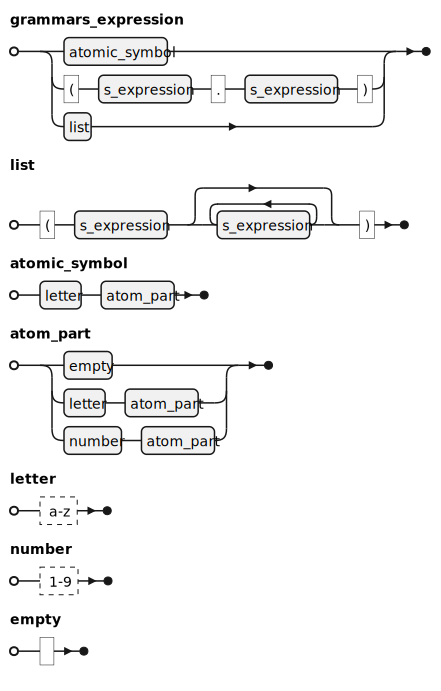


# umba-md-pp - Markdown препроцессор

**umba-md-pp** - препроцессор для подготовки документации с использованием markdown-разметки
простого текста.

# Важные ссылки

- [Перечень страниц (индекс документации)](doc/pages_index.md)
- [TODO](doc/todo.md)
- [Опции командной строки](doc/umba-md-pp-options.md)
- [Основные исходники](doc/_sources_brief.md)


## Тест макроподстановки в именах включаемых файлов

Этот файл подключен со значением макроса `INSERT_DOC_FILENAME_MACRO_TEST`, равным `by_macro2`.


# Основные возможности

Основная идея была в том, чтобы писать и хранить документацию по софтовым проектам непосредственно в проекте,
не используя никакие дополнительные конфлюэнцы и тп.

Doxygen - имеет право на жизнь, но, в основном, как средство создания полновесной справочной документации.
Такая документация не всегда нужна, да и сложно заставить разработчиков документировать каждую функцию.
При этом, даже если каждая функция задокументированна, общее предствление, как всем этим добром пользоваться,
справочная документация не даёт.

Хорошим вариантом видится написание статей по тем или иным аспектам использования кода/библиотек, которые бы лежали
непосредственно рядом с исходным кодом.

Язык разметки markdown выглядит для этого довольно неплохо, и он из коробки поддерживается GitHub'ом и GitLab'ом - 
можно зайти в репозиторий через браузер и изучать документацию прямо там.

У markdown есть недостаток - всё содержимое должно быть включено в MD-документ. Это неудобно, когда
мы описываем вещи и явления, не зависящие от нас - нам приходится следить, чтобы содержимое MD-файлов 
соответствовало реальному положению дел.

Это довольно трудозатратно. Но что если попробовать научить markdown брать текст документа из внешних документов 
и исходных тестов программ? Тогда нам нужен препроцессор.

Вторая проблема при ведении документации в формате markdown или каком-то аналогичном - 
это то, что нет никаких средств для локального просмотра. Я попытался решить и эту проблему, сделав локальный рендерер
(пока он работает на базе Doxygen). Локальный рендерер при вызове создаёт временную папку в домашнем каталоге пользователя, 
подготавливает файл для генерации конечного документа, вызывает Doxygen для генерации RTF, и открывает полученный RTF
в ассоциированной с ним программе (обычно это MS Word). Локальный рендерер умеет интегрироваться в систему, и просмотр 
`.MD` файлов запускается по клику из проводника (бонусов идёт то, что `.MD` отображаются с соответствующей иконкой в проводнике).
Локальный рендерер реализован пока только под ОС Windows.

Основные возможности **umba-md-pp**:

- умеет автоматически нумеровать разделы документа (`--processing-options=numeric-sections`);
- умеет автоматически формировать раздел "Содержание" и включать его в любом месте документа
  по команде `#!toc`/`#$toc`,
  или в начале документа, если положение TOC не задано в документе (`--processing-options=generate-toc`);
- умеет вставлять внешние документы из отдельных файлов, как часть текущего документа,
  при этом изменяя уровень заголовков вставляемого документа (`#!insert{doc,raise=+-N} included_doc.md`);
- умеет вставлять в документ фрагменты кода из внешних файлов, по тэгам и по номерам
  строк, при этом добавляя номера строк исходного файла, и имя файла, откуда было сделано
  включение (`#!insert{line-no} snippets.cpp#CODE_FRAGMENT_NAME`);
- умеет задавать условные переменные для проверки их при включении файлов или фрагментов кода (`--set-condition-var=ALLOW_EXTERNAL_INC:1`);
- умеет при включении файлов или фрагментов кода из внешних файлов проверять заданные условия и производить
  включение документов/фрагментов кода по условию (`#!insert{ifdef:ALLOW_EXTERNAL_INC,if:$ALLOW_EXTERNAL_INC!=0,if:$google_inc!=0} google_inc.md`);
- умеет в условное включение документов и/или фрагментов кода при наличии файла документа/кода: при ошибке
  включения документа можно подавить сообщения об ошибках (`#!insert{no-fail} ...`);
- умеет однострочные коментарии вида `#//`;
- умеет многострочные коментарии вида `#/*`/`#*/`;
- умеет в метаданные **Markdown**;


# Пакетный режим

В пакетном режиме утилита просматривает все файлы `.md_` (на самом деле входных расширений больше),
и генерирует рядом процессированные `.md` файлы (расширение зависит от входного).

Процессинг может производится не "по месту", а в отдельную папку - так можно генерировать содержимое
GitHub/GitLab wiki, например.


# Локальная утилита просмотра .md_ и .md файлов

Локальная утилита просмотра умеет регистрироваться в системе под текущим пользователем для поддерживаемых расширений,
и по клику в проводнике открывать RTF, сгенерированный из markdown'а.

Для рендеринга в текущий момент используется Doxygen, в далёких планах - сделать свой рендерер.


# Поддержка GraphViz

Утилита позволяет в расширенном markdown'е вставлять графы на языке GraphViz как непосредственно
в теле докумена, так и из внешнего файла. Требуется установленный GraphViz (обычно ставится вместе с Doxygen).
Используются тэги `<graph>`/`</graph>`.


# Поддержка PlantUML

В ближайшее время планируется поддержка PlantUML для рендеринга UML из языка PlantUML, по аналогии с GraphViz.


# Вставка таблиц CSV

Предполагается генерация таблиц из внедрённого или внешнего CSV.


# Вставка сниппетов

На фрагменты кода можно ссылаться через имя файла и якорь: `src/somefile.cpp#400-410`.

Якоря имеют диапазон: стартовый якорь, и конечный якорь.

Стартовый якорь:

- тэг. Для каждого языка задается префикс тэга, например, для C++ это `//#!`. После префикса идёт имя тэга без пробелов.
  Окончание фрагмента ищется как пустой префикс ил префикс с таким же тэгом. Учитывается вложенность. Вложенные тэги при вставке
  могут удаляться или заменятся пустой строкой (чтобы не ломать количество строк).
- номер строки.
- сигнатура кода. Пробелы не участвуют в сравнении. В якоре сигнатуру можно задать в одну строку, в исходниках, где она ищется, 
  сигнатура может быть размазана по нескольким строкам. В случае сигнатур можно задавать последовательность - 
  "вставить фрагмент с сигнатурой, которая появляется после сигнатуры1 и сигнатуры2"

Конечный якорь. Допустимы стартовые якоря, а также:
- якорь `{}` - означает вставку блока, ограниченного блоковыми скобками, 
  с учетом вложенности (но строковые литералы не разбираются, на них может происходить сбой, если они содержат блоковые символы).
  Блоковые символы задаются для каждого языка отдельно.
- якорь `(N)`, где N - число пустых строк, по обнаружению которых детектится конец фрагмента кода.
- якорь `(-)` - линия-разделитель, задаётся для каждого языка отдельно в произвольном количестве вариантов, для C++ это, например,
  `//---` или `/***`. Задаются только префиксы, т.е. `//------------` - это тоже линия разделитель

Извлекаем фрагмент кода по сигнатуре:
```
#!insert{nolineno,noKeepCutTags} umba-md-pp/extern_tools.h#`inline std::string findDoxygenBinPathImpl(bool dontTouchSystem)`-{}
```

```cpp
inline std::string findDoxygenBinPathImpl(bool dontTouchSystem)
{
    if (dontTouchSystem)
        return std::string();

#if defined(WIN32) && defined(_WIN32)

    std::wstring p;
    if (!umba::win32_utils::regQueryAppInstallLocationBin(std::wstring(L"doxygen_is1"), p))
        return std::string();

    return umba::toUtf8(p);

#else

    return std::string();

#endif
}
```


# Стандартный конфиг

```
# Управляем предупреждениями и сообщениями
--info=-all
--warning=+all

# Устанавливаем русский как язык документов по умолчанию, если язык не задан тэгами,
# не переопределён дефолтный язык где-то потом или не задан принудительно через опцию --force-document-language
# Задание языка необходимо для доксигена, если по дефолту задать не русский, или не задавать язык, доксиген кракозяблы генерит
--document-language=russian

# External programs lookup
--dont-lookup-for-doxygen
--dont-lookup-for-graphviz

# Common options
--processing-options=generate-toc,title
--set-insert-options=fail,path,filename-line-no,trim-arround
--batch-page-index-file=doc/Index.md

# Graphviz common options
--graphviz-output-format=svg
--graphviz-dpi=120
--graphviz-show-labels=true

# Расширения, обрабатываемые (и сканируемые) MDPP
# старое
#--add-mdpp-extentions=_md,_md_,md_,_markdown,_markdown_,markdown_

# новое
--add-mdpp-extentions=_md,_md_,md_
--add-mdpp-extentions=_mkd,_mkd_,mkd_
--add-mdpp-extentions=_mdwn,_mdwn_,mdwn_
--add-mdpp-extentions=_mdown,_mdown_,mdown_
--add-mdpp-extentions=_mdtxt,_mdtxt_,mdtxt_
--add-mdpp-extentions=_mdtext,_mdtext_,mdtext_
--add-mdpp-extentions=_markdown,_markdown_,markdown_
#--add-mdpp-extentions=_text,_text_,text_

# Исключаем из сканирования в пакетном режиме подкаталоги со следующими именами
--batch-exclude-dirs=_md,_md_,md_
--batch-exclude-dirs=_mkd,_mkd_,mkd_
--batch-exclude-dirs=_mdwn,_mdwn_,mdwn_
--batch-exclude-dirs=_mdown,_mdown_,mdown_
--batch-exclude-dirs=_mdtxt,_mdtxt_,mdtxt_
--batch-exclude-dirs=_mdtext,_mdtext_,mdtext_
--batch-exclude-dirs=_markdown,_markdown_,markdown_
--batch-exclude-dirs=doc.dox,doc.doxy,doc.doxygen,.dox,.doxy,.doxygen,dox,doxy,doxygen
#--batch-exclude-dirs=_text,_text_,text_

--batch-exclude-dir=.out,.build,.git,.bat,.cmake,.msvc,.vscode,.vs,.config


# При генерации вьювером название файла задается на основании заголовка (из тэгов или первого заголовка, или из первых строк) документа
# Но мы придерживаемся идеи не использовать русские имена без крайней необходимости
--processing-options=transliterate-generated-filenames
# --processing-options=no-transliterate-generated-filenames

# Metatags misspelling replaces and transliteration result replaces
--meta-tag-replace=avtor:author
--meta-tag-replace=avtory:author
--meta-tag-replace=authors:author
--meta-tag-replace=tegi:tags
--meta-tag-replace=teg:tags
--meta-tag-replace=data:date
--meta-tag-replace=zagolovok:title
--meta-tag-replace=nazvanie:title
--meta-tag-replace=caption:title
--meta-tag-replace=kategorii:category
--meta-tag-replace=kategoriya:category
--meta-tag-replace=categories:category
--meta-tag-replace=opisanie:description
--meta-tag-replace=otmazka:disclaimer
--meta-tag-replace=otmazki:disclaimer
--meta-tag-replace=disclaimers:disclaimer
--meta-tag-replace=versiya:version
--meta-tag-replace=yazyk:language
--meta-tag-replace=yazyk dokumenta:language
--meta-tag-replace=otkaz ot otvetstvennosti:disclaimer

# Metatags serialization: CanonicalName:TargetName
--meta-tag-serialize=title:Title
--meta-tag-serialize=disclaimer:Disclaimer
--meta-tag-serialize=description:Description
--meta-tag-serialize=author:Author
--meta-tag-serialize=category:Category
--meta-tag-serialize=date:Date
--meta-tag-serialize=tags:Tags
--meta-tag-serialize=version:Version
--meta-tag-serialize=language:Language
--meta-tag-serialize=url:Url

# Metatag types
--meta-tag-set-type=comma-set:category,tags
--meta-tag-set-type=comma-list:author
--meta-tag-set-type=text-first:title,date,url
--meta-tag-set-type=text-merge:disclaimer,description


# C++
--add-lang-file-extentions=C++:.cpp,.cxx,.c++,.cc,.h,.hpp,.h++,.ixx,.i++,.i
--add-lang-cut-prefix=C++://#!
--add-lang-cut-prefix=C++://#$
--add-lang-cut-prefix=C++:/*#!
--add-lang-cut-prefix=C++:/*#$
--add-lang-separator-prefix=C++://---
--add-lang-separator-prefix=C++:/***
--set-lang-block-chars=C++:{}
--set-lang-listing-tag=C++:cpp

# C
--add-lang-file-extentions=C:.c
--add-lang-cut-prefix=C://#!
--add-lang-cut-prefix=C://#$
--add-lang-cut-prefix=C:/*#!
--add-lang-cut-prefix=C:/*#$
--add-lang-separator-prefix=C://---
--add-lang-separator-prefix=C:/***
--set-lang-block-chars=C:{}
--set-lang-listing-tag=C:cpp

# Squrrel
--add-lang-file-extentions=Squrrel:.nut,.nuts
--add-lang-cut-prefix=Squrrel://#!
--add-lang-cut-prefix=Squrrel://#$
--add-lang-separator-prefix=Squrrel://---
--set-lang-block-chars=Squrrel:{}
--set-lang-listing-tag=Squrrel:lua

# CMake
--add-lang-file-extentions=CMake:CMakeLists.txt,.cmake
--add-lang-cut-prefix=CMake:#//!
--add-lang-cut-prefix=CMake:#//$
--add-lang-separator-prefix=C++:###
--add-lang-separator-prefix=C++:#---
# No blocks support in CMake
--set-lang-listing-tag=CMake:cmake
```


# Любите ли вы документацию так, как люблю её я?

Думаю ещё сделать всяких штук типа эпиграфов, и тп.

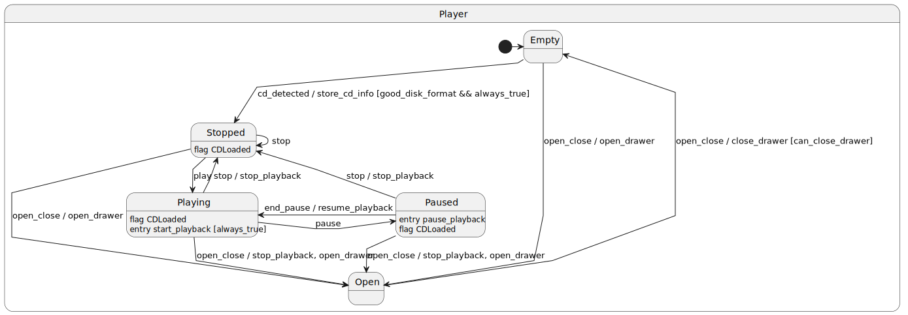


# PlantUML Samples


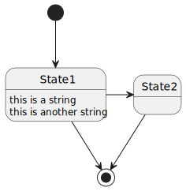

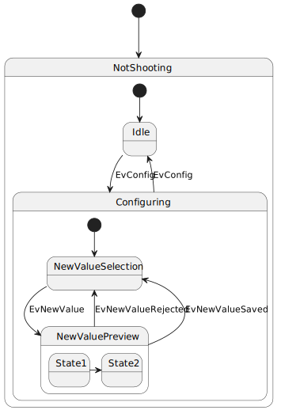
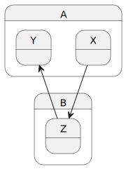
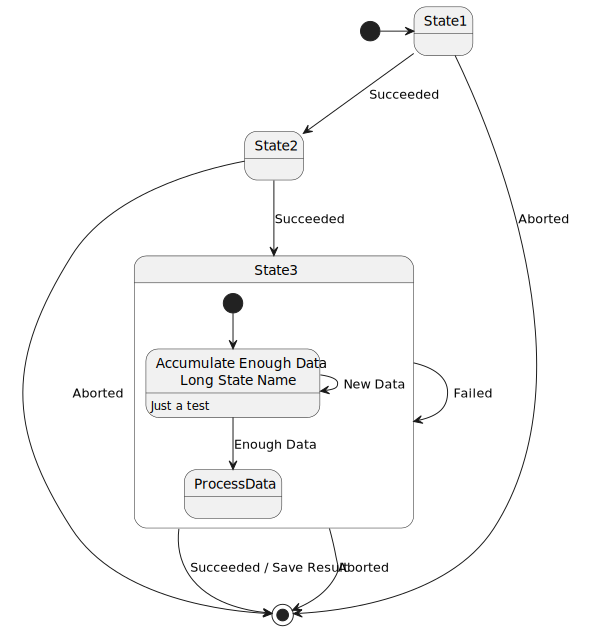
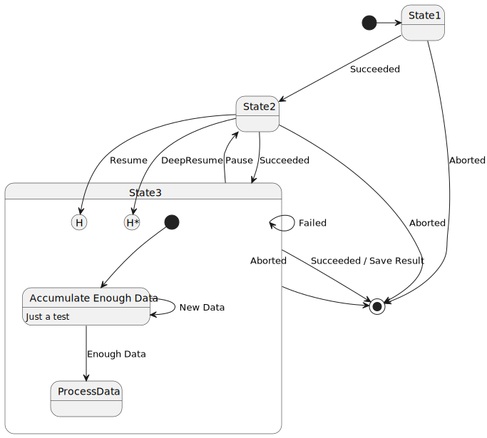
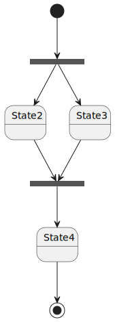
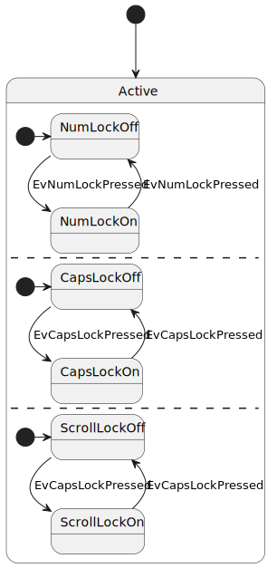
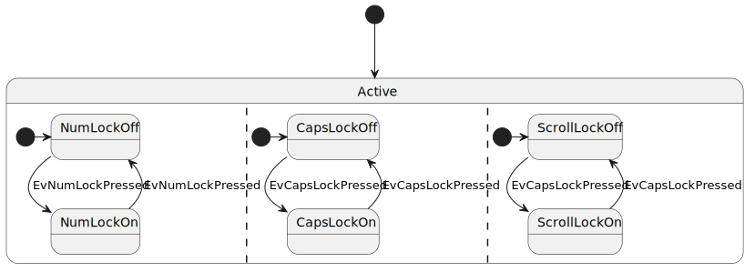
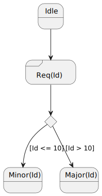
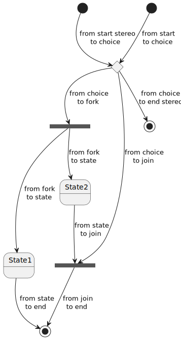

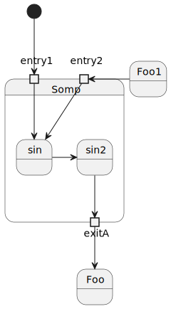
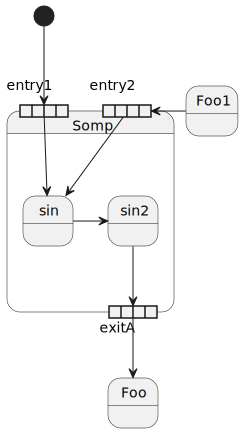
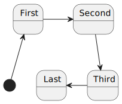
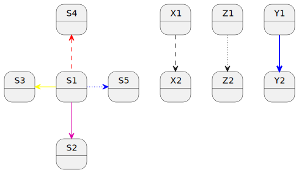
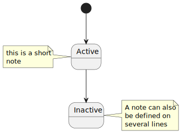
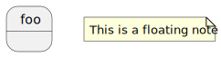
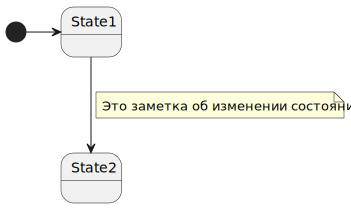
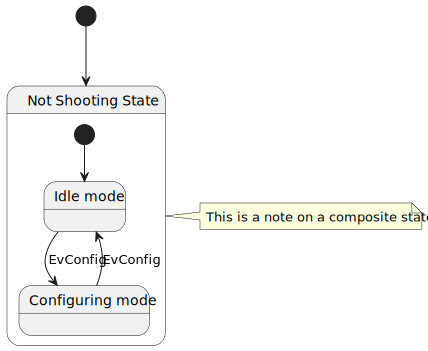
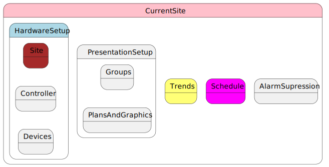
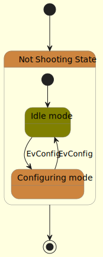
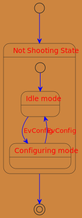

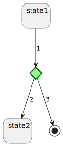
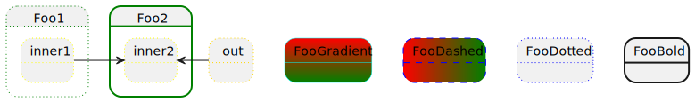


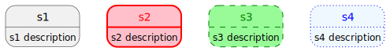
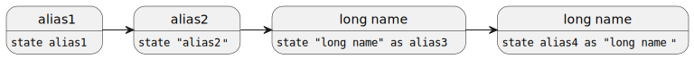


# Boost MSM

[Boost MSM documentation](https://www.boost.org/doc/libs/1_85_0/libs/msm/doc/HTML/ch03s04.html)


