# Препроцессор для Markdown

Утилита, добавляющая некоторые возможности к Markdown

Test number one


# umba-md-pp - Markdown препроцессор

**umba-md-pp** - препроцессор для подготовки документации с использованием markdown-разметки
простого текста.

# Важные ссылки

 - [Перечень страниц (индекс документации)](pages.md)
 - [TODO](doc/todo.md)

## Тест макроподстановки в именах включаемых файлов

Этот файл подключен со значением макроса `INSERT_DOC_FILENAME_MACRO_TEST`, равным `by_macro2`.


# Основные возможности

Основные возможности **umba-md-pp**:

  - умеет автоматически нумеровать разделы документа (`--processing-options=numeric-sections`);
  - умеет автоматически формировать раздел "Содержание" и включать его в любом месте документа
    по команде `#!toc`/`#$toc`,
    или в начале документа, если положение TOC не задано в документе (`--processing-options=generate-toc`);
  - умеет вставлять внешние документы из отдельных файлов, как часть текущего документа,
    при этом изменяя уровень заголовков вставляемого документа (`#!insert{doc,raise=+-N} included_doc.md`);
  - умеет вставлять в документ фрагменты кода из внешних файлов, по тэгам и по номерам
    строк, при этом добавляя номера строк исходного файла, и имя файла, откуда было сделано
    включение (`#!insert{line-no} snippets.cpp#CODE_FRAGMENT_NAME`);
  - умеет задавать условные переменные для проверки их при включении файлов или фрагментов кода (`--set-condition-var=ALLOW_EXTERNAL_INC:1`);
  - умеет при включении файлов или фрагментов кода из внешних файлов проверять заданные условия и производить
    включение документов/фрагментов кода по условию (`#!insert{ifdef:ALLOW_EXTERNAL_INC,if:$ALLOW_EXTERNAL_INC!=0,if:$google_inc!=0} google_inc.md`);
  - умеет в условное включение документов и/или фрагментов кода при наличии файла документа/кода: при ошибке
    включения документа можно подавить сообщения об ошибках (`#!insert{no-fail} ...`);
  - умеет однострочные коментарии вида `#//`;
  - умеет многострочные коментарии вида `#/*`/`#*/`;
  - умеет в метаданные **Markdown**;


Пытаемся в графы

[Node Shapes](https://graphviz.org/doc/info/shapes.html)
[Undirected Graphs](https://graphviz.org/Gallery/undirected/)
[Directed Graphs examples](https://graphviz.org/Gallery/directed/)
[Neato Spring Graphs eamples](https://graphviz.org/Gallery/neato/)
[Twopi Radial Graphs](https://graphviz.org/Gallery/twopi/)

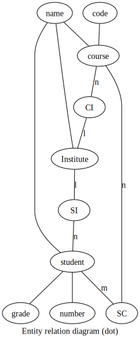
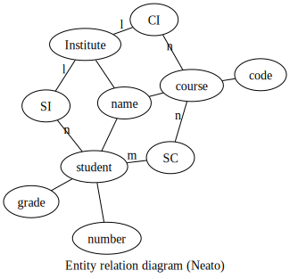
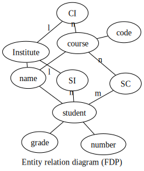
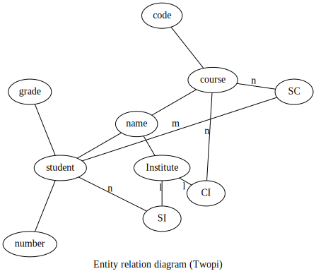
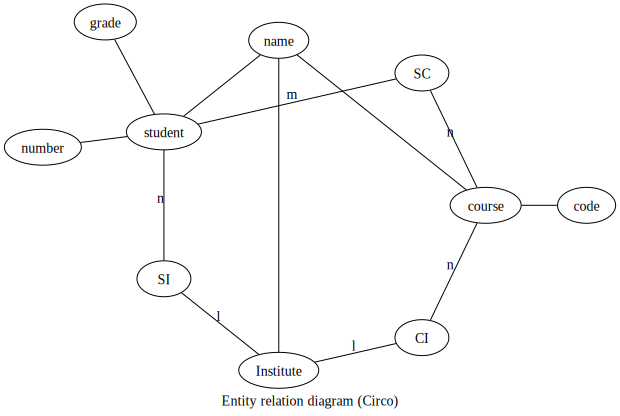


</graph>

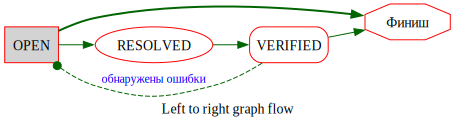


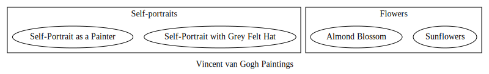

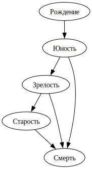

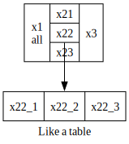

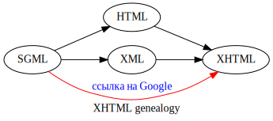

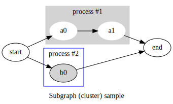


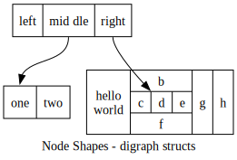


Пытаемся в картинки


[ TODO](doc/todo.md)


Включаем по сигнатуре, блок, но сигнатура в одну строку при ссылке

!!! File not found in: C:\work\github\umba-tools\umba-md-pp\doc\doc, C:\work\github\umba-tools\umba-md-pp\tests\snippets\tests\snippets, C:\work\github\umba-tools\umba-md-pp\src\src
#!insert{lineno} cpp\signature_test.cpp#`inline void simpleDoNothing`-{}

Включаем по сигнатуре, блок, но сигнатура в одну строку в файле

!!! File not found in: C:\work\github\umba-tools\umba-md-pp\doc\doc, C:\work\github\umba-tools\umba-md-pp\tests\snippets\tests\snippets, C:\work\github\umba-tools\umba-md-pp\src\src
#!insert{lineno} cpp\signature_test.cpp#`inline\nvoid simpleNothing2`-{}

Включаем по сигнатуре, блок, шаблонная функция

!!! File not found in: C:\work\github\umba-tools\umba-md-pp\doc\doc, C:\work\github\umba-tools\umba-md-pp\tests\snippets\tests\snippets, C:\work\github\umba-tools\umba-md-pp\src\src
#!insert{lineno} cpp\signature_test.cpp#`template<typename StringType>\nbool isUrlAbsolute`-{}

Включаем по сигнатуре, блок, нешаблонная функция, первая версия (без использования сигнатурного пути)

!!! File not found in: C:\work\github\umba-tools\umba-md-pp\doc\doc, C:\work\github\umba-tools\umba-md-pp\tests\snippets\tests\snippets, C:\work\github\umba-tools\umba-md-pp\src\src
#!insert{lineno} cpp\signature_test.cpp#`inline\nvoid simpleDoNothing`-{}

Включаем по сигнатуре, блок, нешаблонная функция, вторая версия (с использованием сигнатурного пути)

!!! File not found in: C:\work\github\umba-tools\umba-md-pp\doc\doc, C:\work\github\umba-tools\umba-md-pp\tests\snippets\tests\snippets, C:\work\github\umba-tools\umba-md-pp\src\src
#!insert{lineno} cpp\signature_test.cpp#`template<typename StringType>\nbool isUrlAbsolute`/`inline\nvoid simpleDoNothing`-{}

Включаем по сигнатуре, шаблонная функция, до разделителя

!!! File not found in: C:\work\github\umba-tools\umba-md-pp\doc\doc, C:\work\github\umba-tools\umba-md-pp\tests\snippets\tests\snippets, C:\work\github\umba-tools\umba-md-pp\src\src
#!insert{lineno} cpp\signature_test.cpp#`template<typename StringType>\nbool isUrlAbsolute`-(-)

Включаем по сигнатуре, шаблонная функция, до двух пустых строк

!!! File not found in: C:\work\github\umba-tools\umba-md-pp\doc\doc, C:\work\github\umba-tools\umba-md-pp\tests\snippets\tests\snippets, C:\work\github\umba-tools\umba-md-pp\src\src
#!insert{lineno} cpp\signature_test.cpp#`template<typename StringType>\nbool isUrlAbsolute`-(2)

Включаем по сигнатуре, от одной сигнатуры до другой

!!! File not found in: C:\work\github\umba-tools\umba-md-pp\doc\doc, C:\work\github\umba-tools\umba-md-pp\tests\snippets\tests\snippets, C:\work\github\umba-tools\umba-md-pp\src\src
#!insert{lineno} cpp\signature_test.cpp#`inline\nvoid simpleDoNothing`-`inline\nvoid simpleDoNothing`

Включаем по номерам строк

!!! File not found in: C:\work\github\umba-tools\umba-md-pp\doc\doc, C:\work\github\umba-tools\umba-md-pp\tests\snippets\tests\snippets, C:\work\github\umba-tools\umba-md-pp\src\src
#!insert{lineno} umba-md-pp\log.h#6-12


# 3 Подключенные для примера результаты тестов


Скопировать данный файл на уровень выше.

tests/img/filled-96.png на уровень выше.

Картинко - 


## Title

Test01
Link to [test02.md](tests/test02.md)
Image - 

Link to document which is out of the hierarchy [upper_inc.md_](../upper_inc.md)
Image from out of the  hierarchy- 


// Print lines, noKeepCutTags #print_ver_all

!!! File not found in: C:\work\github\umba-tools\umba-md-pp\doc\doc, C:\work\github\umba-tools\umba-md-pp\tests\snippets\tests\snippets, C:\work\github\umba-tools\umba-md-pp\src\src
#!insert{lineno,noKeepCutTags} cpp/print_ver.h#print_ver_all


// Print lines, keepCutTags   #print_ver_all

!!! File not found in: C:\work\github\umba-tools\umba-md-pp\doc\doc, C:\work\github\umba-tools\umba-md-pp\tests\snippets\tests\snippets, C:\work\github\umba-tools\umba-md-pp\src\src
#!insert{lineno,noKeepCutTags} cpp/print_ver.h#print_ver_all


// No lines, keepCutTags   #print_ver_all

!!! File not found in: C:\work\github\umba-tools\umba-md-pp\doc\doc, C:\work\github\umba-tools\umba-md-pp\tests\snippets\tests\snippets, C:\work\github\umba-tools\umba-md-pp\src\src
#!insert{nolineno,noKeepCutTags} cpp/print_ver.h#print_ver_all


// printCommitHash

!!! File not found in: C:\work\github\umba-tools\umba-md-pp\doc\doc, C:\work\github\umba-tools\umba-md-pp\tests\snippets\tests\snippets, C:\work\github\umba-tools\umba-md-pp\src\src
#!insert{lineno} cpp/print_ver.h#printCommitHash


// printOnlyVersion

!!! File not found in: C:\work\github\umba-tools\umba-md-pp\doc\doc, C:\work\github\umba-tools\umba-md-pp\tests\snippets\tests\snippets, C:\work\github\umba-tools\umba-md-pp\src\src
#!insert{lineno} cpp/print_ver.h#printOnlyVersion


### Subtitle
#### Русский заголовок третьего уровня

```
lst existing
#!insert{lineno} ..\src\umba-md-pp\log.h#6-12 - this command not processed due it in listing
```

https://moonbase59.github.io/gh-toc/
https://docs.github.com/ru/get-started/writing-on-github/getting-started-with-writing-and-formatting-on-github/basic-writing-and-formatting-syntax
Github tips, notes, warnings and so on - https://docs.github.com/ru/get-started/writing-on-github/getting-started-with-writing-and-formatting-on-github/basic-writing-and-formatting-syntax#alerts
todo's - https://docs.github.com/ru/get-started/writing-on-github/getting-started-with-writing-and-formatting-on-github/basic-writing-and-formatting-syntax#task-lists

!!! File not found in: C:\work\github\umba-tools\umba-md-pp\doc\doc, C:\work\github\umba-tools\umba-md-pp\tests\snippets\tests\snippets, C:\work\github\umba-tools\umba-md-pp\src\src
#!insert{lineno} ..\src\umba-md-pp\log.h#6-12

!!! File not found in: C:\work\github\umba-tools\umba-md-pp\doc\doc, C:\work\github\umba-tools\umba-md-pp\tests\snippets\tests\snippets, C:\work\github\umba-tools\umba-md-pp\src\src
#!insert{lineno} cpp/print_ver.h#print_ver_all

!!! File not found in: C:\work\github\umba-tools\umba-md-pp\doc\doc, C:\work\github\umba-tools\umba-md-pp\tests\snippets\tests\snippets, C:\work\github\umba-tools\umba-md-pp\src\src
#!insert{lineno} cpp/print_ver.h#printOnlyVersion

## Other Title

### Other Subtitle

Bla-bla.

  - [umba-md-pp - Markdown препроцессор](#user-content-umba-md-pp---markdown-препроцессор)
  - [Важные ссылки](#user-content-важные-ссылки)
    - [Тест макроподстановки в именах включаемых файлов](#user-content-тест-макроподстановки-в-именах-включаемых-файлов)
  - [Основные возможности](#user-content-основные-возможности)
  - [3 Подключенные для примера результаты тестов](#user-content-3-подключенные-для-примера-результаты-тестов)
    - [Title](#user-content-title)
      - [Subtitle](#user-content-subtitle)
        - [Русский заголовок третьего уровня](#user-content-русский-заголовок-третьего-уровня)
    - [Other Title](#user-content-other-title)
      - [Other Subtitle](#user-content-other-subtitle)
    - [3.1 Title](#user-content-31-title)
      - [3.1.1 Subtitle](#user-content-311-subtitle)
        - [Русский заголовок третьего уровня](#user-content-русский-заголовок-третьего-уровня-1)
    - [3.2 Other Title](#user-content-32-other-title)
      - [3.2.1 Other Subtitle](#user-content-321-other-subtitle)


## 3.1 Title

Test01

// Print lines, noKeepCutTags #print_ver_all

!!! File not found

!!! File not found in: C:\work\github\umba-tools\umba-md-pp\doc\doc, C:\work\github\umba-tools\umba-md-pp\tests\snippets\tests\snippets, C:\work\github\umba-tools\umba-md-pp\src\src
#!insert{lineno,noKeepCutTags} cpp/print_ver.h#print_ver_all


// Print lines, keepCutTags   #print_ver_all

!!! File not found

!!! File not found in: C:\work\github\umba-tools\umba-md-pp\doc\doc, C:\work\github\umba-tools\umba-md-pp\tests\snippets\tests\snippets, C:\work\github\umba-tools\umba-md-pp\src\src
#!insert{lineno,noKeepCutTags} cpp/print_ver.h#print_ver_all


// No lines, keepCutTags   #print_ver_all

!!! File not found

!!! File not found in: C:\work\github\umba-tools\umba-md-pp\doc\doc, C:\work\github\umba-tools\umba-md-pp\tests\snippets\tests\snippets, C:\work\github\umba-tools\umba-md-pp\src\src
#!insert{nolineno,noKeepCutTags} cpp/print_ver.h#print_ver_all


// printCommitHash

!!! File not found

!!! File not found in: C:\work\github\umba-tools\umba-md-pp\doc\doc, C:\work\github\umba-tools\umba-md-pp\tests\snippets\tests\snippets, C:\work\github\umba-tools\umba-md-pp\src\src
#!insert{lineno} cpp/print_ver.h#printCommitHash


// printOnlyVersion

!!! File not found

!!! File not found in: C:\work\github\umba-tools\umba-md-pp\doc\doc, C:\work\github\umba-tools\umba-md-pp\tests\snippets\tests\snippets, C:\work\github\umba-tools\umba-md-pp\src\src
#!insert{lineno} cpp/print_ver.h#printOnlyVersion


### 3.1.1 Subtitle
#### Русский заголовок третьего уровня

```
lst existing
#!insert{lineno} ..\src\umba-md-pp\log.h#6-12 - this command not processed due it in listing
```

https://moonbase59.github.io/gh-toc/
https://docs.github.com/ru/get-started/writing-on-github/getting-started-with-writing-and-formatting-on-github/basic-writing-and-formatting-syntax
Github tips, notes, warnings and so on - https://docs.github.com/ru/get-started/writing-on-github/getting-started-with-writing-and-formatting-on-github/basic-writing-and-formatting-syntax#alerts
todo's - https://docs.github.com/ru/get-started/writing-on-github/getting-started-with-writing-and-formatting-on-github/basic-writing-and-formatting-syntax#task-lists


!!! File not found

!!! File not found in: C:\work\github\umba-tools\umba-md-pp\doc\doc, C:\work\github\umba-tools\umba-md-pp\tests\snippets\tests\snippets, C:\work\github\umba-tools\umba-md-pp\src\src
#!insert{lineno} cpp/print_ver.h#print_ver_all

!!! File not found

!!! File not found in: C:\work\github\umba-tools\umba-md-pp\doc\doc, C:\work\github\umba-tools\umba-md-pp\tests\snippets\tests\snippets, C:\work\github\umba-tools\umba-md-pp\src\src
#!insert{lineno} cpp/print_ver.h#printOnlyVersion

## 3.2 Other Title

### 3.2.1 Other Subtitle

Bla-bla.

  - [1 umba-md-pp - Markdown препроцессор](user-content-1-umba-md-pp---markdown-препроцессор)[1 umba-md-pp - Markdown препроцессор](#)
  - [2 Основные возможности](user-content-2-основные-возможности)[2 Основные возможности](#)
  - [3 Подключенные для примера результаты тестов](user-content-3-подключенные-для-примера-результаты-тестов)[3 Подключенные для примера результаты тестов](#)
    - [3.1 Title](user-content-31-title)[3.1 Title](#)
      - [3.1.1 Subtitle](user-content-311-subtitle)[3.1.1 Subtitle](#)
    - [3.2 Other Title](user-content-32-other-title)[3.2 Other Title](#)
      - [3.2.1 Other Subtitle](user-content-321-other-subtitle)[3.2.1 Other Subtitle](#)


