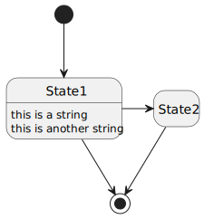

**Информация о документе**

**Описание**: Утилита, добавляющая некоторые возможности к Markdown

**Авторы**:
- Имя <name@at.domain.com>
- Имя2 <name2@domain.com>
- HelloFromDot <ehlo@dot.org>
- HelloFromPuml <ehlo@puml.org>

**URL**: https://github.com/al-martyn1/umba-md-pp/blob/main/README.md

---

# Препроцессор для Markdown

Утилита, добавляющая некоторые возможности к Markdown

          - [**Определения**](#определения)
          - [**Параметры**](#параметры)
  - [Список важных предупреждений](#список-важных-предупреждений)
    - [_src/simple-drawing](#_srcsimple-drawing)
    - [_src/umba-md-pp](#_srcumba-md-pp)
    - [_src/umba-md-pp/md](#_srcumba-md-ppmd)
  - [Список предупреждений](#список-предупреждений)
  - [Список задач](#список-задач)
    - [_libs/marty_format/impl](#_libsmarty_formatimpl)
    - [_src/umba-md-pp](#_srcumba-md-pp-1)
    - [_src/umba-md-pp/code-processing](#_srcumba-md-ppcode-processing)
  - [Список недоделанного](#список-недоделанного)
  - [Список заметок](#список-заметок)
    - [_src/umba-md-pp](#_srcumba-md-pp-2)
  - [Список "см. также"](#список-см-также)
    - [_libs/marty_format](#_libsmarty_format)
- [Основные возможности](#основные-возможности)
- [Пакетный режим](#пакетный-режим)
- [Локальная утилита просмотра .md_ и .md файлов](#локальная-утилита-просмотра-md_-и-md-файлов)
- [Поддержка GraphViz](#поддержка-graphviz)
- [Поддержка PlantUML](#поддержка-plantuml)
- [Вставка таблиц CSV](#вставка-таблиц-csv)
- [Вставка сниппетов](#вставка-сниппетов)
- [Стандартный конфиг](#стандартный-конфиг)
- [Любите ли вы документацию так, как люблю её я?](#любите-ли-вы-документацию-так-как-люблю-её-я)
- [GraphViz Samples](#graphviz-samples)
- [PlantUML Samples](#plantuml-samples)
- [Boost MSM](#boost-msm)


---
**Авторы**:
- Имя <name@at.domain.com>
- Имя2 <name2@domain.com>
- HelloFromDot <ehlo@dot.org>
- HelloFromPuml <ehlo@puml.org>

**URL**: https://github.com/al-martyn1/umba-md-pp/blob/main/README.md

---


> [!WARNING]
> **Заголовок:**
> Предупреждение Предупреждение Предупреждение Предупреждение
> Предупреждение Предупреждение Предупреждение Предупреждение

> [!CAUTION]
> **Titel:**
> caution caution caution caution
> caution
> caution


|Значение|Описание|
|:---|:---|
|**note**|примечание|
|**tip**|совет|
|**important**|важно|
|**warning**|предупреждение|
|**caution**|осторожно|


```
note,n = 0
tip,t
important,i
warning,w
caution,c
todo,d        // дополнительный тип, нет в GFM/GLFM, будем делать как note с заголовком TODO
```


###### **Определения**


**Определение 1** -
Описание 1

**Определение 2** -
Описание 2


###### **Параметры**


**Arg 1** -
Описание 1

**Arg 2** -
Описание 2


|Значение|Описание|
|:---|:---|
|**Value 1**|Value 1 description|
|**Value 2**|Value 2 description|


Автосканированные списки задач, примечаний, предупреждений.


## Список важных предупреждений


### _src/simple-drawing

- `[_src/simple-drawing/smpd-test-001.cpp:323]`
  Inform about exception

- `[_src/simple-drawing/smpd-tokenizer.h:203]`
  Фильтры, установленные позже, отрабатывают раньше

- `[_src/simple-drawing/smpd-tokenizer.h:250]`
  Фильтры, установленные позже, отрабатывают раньше


### _src/umba-md-pp

- `[_src/umba-md-pp/document.h:104]`
  Тут надо добавить что-то типа хидера, или break line Или - не надо?

- `[_src/umba-md-pp/processing.h:163]`
  Хз, зачем это нужно было

- `[_src/umba-md-pp/processing.h:391]`
  Не понятно, с чего этот варнинг вылезает, надо разобраться

- `[_src/umba-md-pp/processing.h:996]`
  Какое-то оформление надо

- `[_src/umba-md-pp/processing.h:1405]`
  JSON-META У нас универсальный парсер YAML/JSON и мета данные могут быть в
  формате JSON При вставке в JSON могут быть проблемы

- `[_src/umba-md-pp/snippet_options.h:686]`
  Тут бы надо предусмотреть, что в первой строке поиска надо пропустить окончание
  сигнатуры, но пока сойдёт и так

- `[_src/umba-md-pp/snippet_options.h:729]`
  Unused variable

- `[_src/umba-md-pp/snippet_options.h:736]`
  Unused variable pCodeExtractor

- `[_src/umba-md-pp/snippet_options.h:759]`
  - или тут надо уменьшить на размер конечной сигнатуры в строках?

- `[_src/umba-md-pp/umba-md-pp-view.cpp:501]`
  Fix RTF here

- `[_src/umba-md-pp/umba-md-pp-view.cpp:537]`
  Это вылезает, если предыдущая версия файла уже открыта в ворде

- `[_src/umba-md-pp/umba_md_processing_utils.h:572]`
  Не понятно, что за состояние, и почему я его не обработал

- `[_src/umba-md-pp/utils.h:542]`
  надо обдумать для других возможных путей


### _src/umba-md-pp/md

- `[_src/umba-md-pp/md/processing_utils.h:173]`
  Тут надо быть внимательным

- `[_src/umba-md-pp/md/processing_utils.h:232]`
  Тут нужно добавить экранирование символов умножения, но они маловероятны,
  поэтому пока не делаем

- `[_src/umba-md-pp/md/processing_utils.h:242]`
  Тут нужно добавить экранирование символов умножения, но они маловероятны,
  поэтому пока не делаем

- `[_src/umba-md-pp/md/processing_utils.h:265]`
  Доделать


## Список предупреждений


## Список задач


### _libs/marty_format/impl

- [ ] `[_libs/marty_format/impl/internal_processFormatValuesImpl.h:437]`
  Если есть BigInt, то форматируем через него, если у нас "целый" форматный
  символ

- [ ] `[_libs/marty_format/impl/internal_processFormatValuesImpl.h:442]`
  Если BigInt'а нет, то форматируем через std::uint64_t getAsUint64() const, не
  забывая про знак

- [ ] `[_libs/marty_format/impl/internal_processFormatValuesImpl.h:1275]`
  Если задано сделать escape для строки то надо сделать escape, но не длиннее,
  чем макс ширина

- [ ] `[_libs/marty_format/impl/internal_processFormatValuesImpl.h:1287]`
  Тут используем UTF итераторы явно, если нам не нужен UTF, надо будет обрубить
  эту возможность


### _src/umba-md-pp

- [ ] `[_src/umba-md-pp/code-options-database.h:117]`
  Пока у нас строки начала/окончания блока односимвольные, но надо переделать,
  желательно везде

- [ ] `[_src/umba-md-pp/processing.h:243]`
  Надо бы ещё принудительно флэттенизировать урлы, которые выходят за пределы
  каталога с документом UMBA_USED(flattenImageLinks);

- [ ] `[_src/umba-md-pp/processing.h:272]`
  Надо бы сделать какой-то null_insert_iterator и null_inserter

- [ ] `[_src/umba-md-pp/processing.h:1009]`
  Нужно добавить обрамление

- [ ] `[_src/umba-md-pp/processing_utils.h:471]`
  Доделать


### _src/umba-md-pp/code-processing

- [ ] `[_src/umba-md-pp/code-processing/utils.h:1328]`
  тут надо проверять, является ли коментарий коментарием спец вида. Пока
  складываем любые коментарии

- [ ] `[_src/umba-md-pp/code-processing/utils.h:1427]`
  тут надо проверять, является ли коментарий коментарием спец вида. Пока
  складываем любые коментарии

- [ ] `[_src/umba-md-pp/code-processing/utils.h:1602]`
  Не поддерживаются C++20 requires

- [ ] `[_src/umba-md-pp/code-processing/utils.h:1604]`
  При бэк-сканировании до начала блока стоп производится в том числе по
  закрывающей блочной скобке При использовании requires requires могут быть
  блочные скобки в заголовке функции, и блок будет выцеплен некорректно Надо
  что-то сделать, возможно, отключать опцией остановку по символу блока

- [ ] `[_src/umba-md-pp/code-processing/utils.h:1740]`
  Тут, наверное, надо удалить символы коментария в начале и в конце, а также доп
  символы, которые использует доксиген: '*'/'!'/'<'

- [ ] `[_src/umba-md-pp/code-processing/utils.h:1819]`
  Тут, наверное, надо удалить символы коментария в начале и в конце, а также доп
  символы, которые использует доксиген: '*'/'!'/'<'


## Список недоделанного


## Список заметок


### _src/umba-md-pp

- `[_src/umba-md-pp/signature.h:38]`
  Не работает для много строчных сигнатур, если в файле они
    по другому разбиты на строки.
    Нужен новый алгоритм.
    Сигнатура, которую мы ищем, всегда задаётся в одну строку.
    Итак.
    1) Очередь пуста. Тупо кладём элемент
    2) Сигнатурная строка, сформированная из очереди, короче искомой - значит, она не может начинаться с искомой - тупо добавляем туда очередную строку (п.1 является частным случаем п.2)
    3) Сигнатурная строка (СС), сформированная из очереди, равна по длине, или длиннее
    Пока текущая СС больше искомой:
    проверяем, начинается ли она с искомой
    Если начинается, то количество элементов в очереди надо вернуть вместе с результатом.
    Если не начинается, то удаляем элемент с начала очереди


## Список "см. также"


### _libs/marty_format

- `[_libs/marty_format/utils.h:825]`
  https://en.cppreference.com/w/cpp/types/void_t


# Основные возможности

Основная идея была в том, чтобы писать и хранить документацию по софтовым проектам непосредственно в проекте,
не используя никакие дополнительные конфлюэнцы и тп.

Doxygen - имеет право на жизнь, но, в основном, как средство создания полновесной справочной документации.
Такая документация не всегда нужна, да и сложно заставить разработчиков документировать каждую функцию.
При этом, даже если каждая функция задокументированна, общее предствление, как всем этим добром пользоваться,
справочная документация не даёт.

Хорошим вариантом видится написание статей по тем или иным аспектам использования кода/библиотек, которые бы лежали
непосредственно рядом с исходным кодом.

Язык разметки markdown выглядит для этого довольно неплохо, и он из коробки поддерживается GitHub'ом и GitLab'ом -
можно зайти в репозиторий через браузер и изучать документацию прямо там.

У markdown есть недостаток - всё содержимое должно быть включено в MD-документ. Это неудобно, когда
мы описываем вещи и явления, не зависящие от нас - нам приходится следить, чтобы содержимое MD-файлов
соответствовало реальному положению дел.

Это довольно трудозатратно. Но что если попробовать научить markdown брать текст документа из внешних документов
и исходных тестов программ? Тогда нам нужен препроцессор.

Вторая проблема при ведении документации в формате markdown или каком-то аналогичном -
это то, что нет никаких средств для локального просмотра. Я попытался решить и эту проблему, сделав локальный рендерер
(пока он работает на базе Doxygen). Локальный рендерер при вызове создаёт временную папку в домашнем каталоге пользователя,
подготавливает файл для генерации конечного документа, вызывает Doxygen для генерации RTF, и открывает полученный RTF
в ассоциированной с ним программе (обычно это MS Word). Локальный рендерер умеет интегрироваться в систему, и просмотр
`.MD` файлов запускается по клику из проводника (бонусов идёт то, что `.MD` отображаются с соответствующей иконкой в проводнике).
Локальный рендерер реализован пока только под ОС Windows.

Основные возможности **umba-md-pp**:

- умеет автоматически нумеровать разделы документа (`--processing-options=numeric-sections`);
- умеет автоматически формировать раздел "Содержание" и включать его в любом месте документа
  по команде `#!toc`/`#$toc`,
  или в начале документа, если положение TOC не задано в документе (`--processing-options=generate-toc`);
- умеет вставлять внешние документы из отдельных файлов, как часть текущего документа,
  при этом изменяя уровень заголовков вставляемого документа (`#!insert{doc,raise=+-N} included_doc.md`);
- умеет вставлять в документ фрагменты кода из внешних файлов, по тэгам и по номерам
  строк, при этом добавляя номера строк исходного файла, и имя файла, откуда было сделано
  включение (`#!insert{line-no} snippets.cpp#CODE_FRAGMENT_NAME`);
- умеет задавать условные переменные для проверки их при включении файлов или фрагментов кода (`--set-condition-var=ALLOW_EXTERNAL_INC:1`);
- умеет при включении файлов или фрагментов кода из внешних файлов проверять заданные условия и производить
  включение документов/фрагментов кода по условию (`#!insert{ifdef:ALLOW_EXTERNAL_INC,if:$ALLOW_EXTERNAL_INC!=0,if:$google_inc!=0} google_inc.md`);
- умеет в условное включение документов и/или фрагментов кода при наличии файла документа/кода: при ошибке
  включения документа можно подавить сообщения об ошибках (`#!insert{no-fail} ...`);
- умеет однострочные коментарии вида `#//`;
- умеет многострочные коментарии вида `#/*`/`#*/`;
- умеет в метаданные **Markdown**;


# Пакетный режим

В пакетном режиме утилита просматривает все файлы `.md_` (на самом деле входных расширений больше),
и генерирует рядом процессированные `.md` файлы (расширение зависит от входного).

Процессинг может производится не "по месту", а в отдельную папку - так можно генерировать содержимое
GitHub/GitLab wiki, например.


# Локальная утилита просмотра .md_ и .md файлов

Локальная утилита просмотра умеет регистрироваться в системе под текущим пользователем для поддерживаемых расширений,
и по клику в проводнике открывать RTF, сгенерированный из markdown'а.

Для рендеринга в текущий момент используется Doxygen, в далёких планах - сделать свой рендерер.


# Поддержка GraphViz

Утилита позволяет в расширенном markdown'е вставлять графы на языке GraphViz как непосредственно
в теле докумена, так и из внешнего файла. Требуется установленный GraphViz (обычно ставится вместе с Doxygen).
Используются тэги `<graph>`/`</graph>`.


# Поддержка PlantUML

В ближайшее время планируется поддержка PlantUML для рендеринга UML из языка PlantUML, по аналогии с GraphViz.


# Вставка таблиц CSV

Предполагается генерация таблиц из внедрённого или внешнего CSV.


# Вставка сниппетов

На фрагменты кода можно ссылаться через имя файла и якорь: `src/somefile.cpp#400-410`.

Якоря имеют диапазон: стартовый якорь, и конечный якорь.

Стартовый якорь:

- тэг. Для каждого языка задается префикс тэга, например, для C++ это `//#!`. После префикса идёт имя тэга без пробелов.
  Окончание фрагмента ищется как пустой префикс ил префикс с таким же тэгом. Учитывается вложенность. Вложенные тэги при вставке
  могут удаляться или заменятся пустой строкой (чтобы не ломать количество строк).
- номер строки.
- сигнатура кода. Пробелы не участвуют в сравнении. В якоре сигнатуру можно задать в одну строку, в исходниках, где она ищется,
  сигнатура может быть размазана по нескольким строкам. В случае сигнатур можно задавать последовательность -
  "вставить фрагмент с сигнатурой, которая появляется после сигнатуры1 и сигнатуры2"

Конечный якорь. Допустимы стартовые якоря, а также:
- якорь `{}` - означает вставку блока, ограниченного блоковыми скобками,
  с учетом вложенности (но строковые литералы не разбираются, на них может происходить сбой, если они содержат блоковые символы).
  Блоковые символы задаются для каждого языка отдельно.
- якорь `(N)`, где N - число пустых строк, по обнаружению которых детектится конец фрагмента кода.
- якорь `(-)` - линия-разделитель, задаётся для каждого языка отдельно в произвольном количестве вариантов, для C++ это, например,
  `//---` или `/***`. Задаются только префиксы, т.е. `//------------` - это тоже линия разделитель

**MSDN**
#!prototype{frag-num,proto-fmt=msdn,frag-start-idx=3}     tests/cc/templates/03_function_template.h#`bool tokenTypeIs`*-{};
**Umba**
#!prototype{frag-num,proto-fmt=umba}     tests/cc/templates/03_function_template.h#`bool tokenTypeIs`*-{};
**Man**
#!prototype{frag-num,proto-fmt=man}      tests/cc/templates/03_function_template.h#`bool tokenTypeIs`*-{};
**Man (table)**
#!prototype{frag-num,proto-fmt=tab-man}  tests/cc/templates/03_function_template.h#`bool tokenTypeIs`*-{};

**MSDN**

```cpp
DWORD
GetLastError();
```
**Umba**

```cpp
DWORD
GetLastError();
```
**Man**

```cpp
DWORD
GetLastError();
```
**Man (table)**

```cpp
DWORD
GetLastError();
```


Извлекаем фрагмент кода по тэгу фрагмента:
```
#!insert{nolineno,noKeepCutTags,filename,path,filename-line-no} umba-md-pp/for_tag_test.cpp#TEST_TAG
```

**umba-md-pp/for_tag_test.cpp:4**
```cpp
void test()
{
}
```

```
#!insert{nolineno,noKeepCutTags} umba-md-pp/enums.h#SnippetOptions
```

```cpp
enum class SnippetOptions : std::uint32_t
{
    invalid              = (std::uint32_t)(-1) /*!<  */,
    unknown              = (std::uint32_t)(-1) /*!<  */,
    noLineNo             = 0x1010 /*!< Do not add line numbers to generated listing */,
    lineNo               = 0x1011 /*!< Add line numbers to generated listing */,
    noTrim               = 0x1020 /*!< Do not trim left inserted code */,
    noTrimLeft           = 0x1020 /*!< Do not trim left inserted code */,
    trim                 = 0x1021 /*!< Trim left inserted code */,
    trimLeft             = 0x1021 /*!< Trim left inserted code */,
    noTag                = 0x1030 /*!< Do not add language tag */,
    noLangTag            = 0x1030 /*!< Do not add language tag */,
    tag                  = 0x1031 /*!< Add language tag */,
    langTag              = 0x1031 /*!< Add language tag */,
    noFilename           = 0x1040 /*!< Do not add filename to listing */,
    filename             = 0x1041 /*!< Add filename to listing */,
    noPath               = 0x1050 /*!< Do not add full path to filename (filename option) */,
    path                 = 0x1051 /*!< Add full path to filename (filename option) */,
    noFail               = 0x1060 /*!< If insertion file not found, don't add insert command text to result - used for C++ __has_include emulation. If there is some other failures occurs (such invalif options), wrong line will be always inserted */,
    fail                 = 0x1061 /*!< If insertion file not found, add insert command text to result. If there is some other failures occurs (such invalif options), wrong line will be always inserted. Default is set in basic configs */,
    noKeepCutTags        = 0x1070 /*!< Don't keep nested cut tags/markers */,
    keepCutTags          = 0x1071 /*!< Keep nested cut tags/markers */,
    noFilenameLineNo     = 0x1080 /*!< Do not add line number to filename before liting */,
    filenameLineNo       = 0x1081 /*!< Add line number to filename before listing */,
    noSnippetOptions     = 0x1090 /*!< Do not add actual snippet options line before listing */,
    snippetOptions       = 0x1091 /*!< Add actual snippet options line before listing */,
    noTrimArround        = 0x10A0 /*!< Do not trim empty lines before and after listing */,
    trimArround          = 0x10A1 /*!< Trim empty lines before and after listing */,
    noDoc                = 0x10B0 /*!< -doc */,
    doc                  = 0x10B1 /*!< Insert as external document, or as snippet otherwise */,
    noQuote              = 0x10C0 /*!< -quote */,
    noQuot               = 0x10C0 /*!< -quote */,
    quote                = 0x10C1 /*!< Insert as blockquote */,
    quot                 = 0x10C1 /*!< Insert as blockquote */,
    noPre                = 0x10D0 /*!< -pre */,
    pre                  = 0x10D1 /*!< pre itself or for inserted quote lines */,
    noProtodoc           = 0x10E0 /*!< -protodoc */,
    noPdoc               = 0x10E0 /*!< -protodoc */,
    protodoc             = 0x10E1 /*!< Generate documentation for prototype */,
    pdoc                 = 0x10E1 /*!< Generate documentation for prototype */,
    noClass              = 0x1100 /*!< -class */,
    noCls                = 0x1100 /*!< -class */,
    class_               = 0x1101 /*!< class option for prototype extraction. */,
    cls                  = 0x1101 /*!< class option for prototype extraction. */,
    noFragmentNumber     = 0x1110 /*!< -fragmentNumber */,
    noFragmentNum        = 0x1110 /*!< -fragmentNumber */,
    noFrgNum             = 0x1110 /*!< -fragmentNumber */,
    noFragNum            = 0x1110 /*!< -fragmentNumber */,
    fragmentNumber       = 0x1111 /*!< add fragment numbers while multiple fragments are extracted */,
    fragmentNum          = 0x1111 /*!< add fragment numbers while multiple fragments are extracted */,
    frgNum               = 0x1111 /*!< add fragment numbers while multiple fragments are extracted */,
    fragNum              = 0x1111 /*!< add fragment numbers while multiple fragments are extracted */,
    subsection           = 0x1811 /*!< Insert document as subsection - adjust section levels to current insertion pos */,
    subsec               = 0x1811 /*!< Insert document as subsection - adjust section levels to current insertion pos */,
    prototype            = 0x1821 /*!< Extract prototype from code snippet */,
    raise                = 0x2011 /*!< Raise section levels in included document up to RISE level */,
    prototypeFormat      = 0x2021 /*!< Prototype formatting style */,
    protoFormat          = 0x2021 /*!< Prototype formatting style */,
    prototypeFmt         = 0x2021 /*!< Prototype formatting style */,
    protoFmt             = 0x2021 /*!< Prototype formatting style */,
    fragmentStart        = 0x2031 /*!< set fragment numeration start index */,
    frgStart             = 0x2031 /*!< set fragment numeration start index */,
    fragStart            = 0x2031 /*!< set fragment numeration start index */,
    fragmentStartIndex   = 0x2031 /*!< set fragment numeration start index */,
    frgStartIndex        = 0x2031 /*!< set fragment numeration start index */,
    fragStartIndex       = 0x2031 /*!< set fragment numeration start index */,
    fragmentStartIdx     = 0x2031 /*!< set fragment numeration start index */,
    frgStartIdx          = 0x2031 /*!< set fragment numeration start index */,
    fragStartIdx         = 0x2031 /*!< set fragment numeration start index */

}; // enum
```


# Стандартный конфиг

```
# Формат файла опций/ответов (response file)
# В одной строке - только одна опция
# Коментарии начинаются с символа '#' или символа ';'
# Коментарии допустимы только в начале строки

# Управляем предупреждениями и сообщениями
--warning=+all
--info=-all

# Устанавливаем русский как язык документов по умолчанию, если язык не задан мета-тэгами,
# не переопределён дефолтный язык где-то потом или не задан принудительно через опцию
# --force-document-language
# Задание языка необходимо для доксигена, если по дефолту задать не русский, или не задавать язык,
# доксиген кракозяблы генерит
# Если в документе задан метатег `Language`, то он переопределяет то, что задано из командной строки
# Если необходимо принудительно из командной строки задать язык документа,
# вне зависимости от содержимого метатегов документа, то следует использовать опцию командой строки
# --force-document-language
--document-language=russian

# Поиск внешних программ
# При поиске используемых внешних программ используются сведения об этих программах,
# которые оставляют в реестре установщики этих программ.
# Антивирусы могут возбуждаться на запросы к реестру к некоторым разделам.
# Данные опции запрещают это, но в таком случае данные программы должны быть прописаны в системной
# переменной PATH
--dont-lookup-for-doxygen
--dont-lookup-for-graphviz

# Базовые опции
--processing-options=generate-toc,title,meta-data-subst
# fragment-number,
--set-insert-options=fail,path,filename-line-no,trim-arround,prototype-format=umba
--batch-page-index-file=doc/Index.md

# Базовые опции для Graphviz
--graphviz-output-format=svg
--graphviz-dpi=120
--graphviz-show-labels=true

# Расширения, обрабатываемые (и сканируемые) MDPP
--add-mdpp-extentions=_md,_md_,md_
--add-mdpp-extentions=_mkd,_mkd_,mkd_
--add-mdpp-extentions=_mdwn,_mdwn_,mdwn_
--add-mdpp-extentions=_mdown,_mdown_,mdown_
--add-mdpp-extentions=_mdtxt,_mdtxt_,mdtxt_
--add-mdpp-extentions=_mdtext,_mdtext_,mdtext_
--add-mdpp-extentions=_markdown,_markdown_,markdown_
#--add-mdpp-extentions=_text,_text_,text_

# Исключаем из сканирования в пакетном режиме подкаталоги со следующими именами.
# Будем называть это "голубятня", "чердак", "loft"
# В голубятне лежат не обрабатываемые в пакетном режиме файлы, предназначенные для подключения
# в файлы документов. Например, мы хотим создать книгу, и публиковать её как отдельные документы,
# так и как книга в сборе. Тогда мы создаём в голубятне главы книги, а в обрабатываемом каталоге
# аналогичные файлы, единственное действие в которых - подключение соответствующих файлов из голубятни.
# Также в обрабатываемом каталоге мы создаём файл TheBook.md_, в который подключаем все главы
# из голубятни, для сборки всех глав в единый документ.
# Также библиотеки/модули могут содержать свою голубятню, в которой хранятся различные документы,
# включаемые как в документацию по данной библиотеке/модулю, но также и предназначенне для включения
# в конечную документацию по продукту, который создаёт пользователь библиотеки/модуля.
--batch-exclude-dirs=_md,_md_,md_
--batch-exclude-dirs=_mkd,_mkd_,mkd_
--batch-exclude-dirs=_mdwn,_mdwn_,mdwn_
--batch-exclude-dirs=_mdown,_mdown_,mdown_
--batch-exclude-dirs=_mdtxt,_mdtxt_,mdtxt_
--batch-exclude-dirs=_mdtext,_mdtext_,mdtext_
--batch-exclude-dirs=_markdown,_markdown_,markdown_
--batch-exclude-dirs=doc.dox,doc.doxy,doc.doxygen,.dox,.doxy,.doxygen,dox,doxy,doxygen
#--batch-exclude-dirs=_text,_text_,text_

--batch-exclude-dir=.out,.build,.git,.bat,.cmake,.msvc,.vscode,.vs,.config


# При генерации вьювером название файла задается на основании заголовка (из тэгов или первого заголовка,
# или из первых строк) документа
# Но мы придерживаемся идеи не использовать русские имена без крайней необходимости
--processing-options=transliterate-generated-filenames
# --processing-options=no-transliterate-generated-filenames

# Ошибки и опечатки в именах тэгов, а также поддержа русскоязычных тэгов
# Тэги в секции метаданных могут указываться на английском и русском языке, а также во множественном числе,
# например:
# Author, Authors, Автор, Авторы
# Имя тэга транслитерируется, потом приводится к нижнему регистру, после этого начинают работу правила
# 'meta-tag-replace' для приведения имён тэгов к каноническому виду.
--meta-tag-replace=avtor:author
--meta-tag-replace=avtory:author
--meta-tag-replace=authors:author
--meta-tag-replace=tegi:tags
--meta-tag-replace=teg:tags
--meta-tag-replace=data:date
--meta-tag-replace=zagolovok:title
--meta-tag-replace=nazvanie:title
--meta-tag-replace=caption:title
--meta-tag-replace=kategorii:category
--meta-tag-replace=kategoriya:category
--meta-tag-replace=categories:category
--meta-tag-replace=opisanie:description
--meta-tag-replace=otmazka:disclaimer
--meta-tag-replace=otmazki:disclaimer
--meta-tag-replace=disclaimers:disclaimer
--meta-tag-replace=versiya:version
--meta-tag-replace=yazyk:language
--meta-tag-replace=yazyk dokumenta:language
--meta-tag-replace=otkaz ot otvetstvennosti:disclaimer
--meta-tag-replace=generators:generator
--meta-tag-replace=brief:description
--meta-tag-replace=briefs:description

# Сериализация метатегов
# Метатеги исходного документа могут сохраняться в результирующий документ в секцию метатэгов
# Тут задаются правила сериализации канонических имён метатегов
--meta-tag-serialize=title:Title
--meta-tag-serialize=disclaimer:Disclaimer
--meta-tag-serialize=description:Description
--meta-tag-serialize=author:Author
--meta-tag-serialize=category:Category
--meta-tag-serialize=date:Date
--meta-tag-serialize=tags:Tags
--meta-tag-serialize=version:Version
--meta-tag-serialize=language:Language
--meta-tag-serialize=url:URL
--meta-tag-serialize=generator:Generator
--meta-tag-serialize=brief:Brief

# Типы метатегов
# Метатеги в результирующий документ собираются из всех включенных документов,
# а также из внешних диаграмм graphviz и PlantUML
# Метатеги записываются в формате YAML, но есть исключения. Так, списки, например, список авторов
# в каноническом виде должен быть записан так:
# ```
# Author:
#   - Name1 <address1@domain.net>
#   - Name2 <address2@domain.com>
# ```
#
# Но для упрощения список авторов может быть записан и через запятую:
# ```
# Author: Name1 <address1@domain.net>, Name2 <address2@domain.com>
# ```
# При этом автор(ы) основного документа будут идти первыми, а авторы использованных поддокументов
# идут в порядке подключения поддокументов и их порядка там (не зависит от способа оформления метатега).
# Для этого мы устанавливаем тип тэга как comma-unique-list - список, однострочное значение разделяется
# запятой, без повторяющихся значений.
#
# Возможные значения:
#
# root-only - текст, используется только значение из корневого элемента.
#
# text-first - текст, используется только первое значение.
#
# text-replace, text-last - текст, используется только последнее значение.
#
# text, text-merge - текст, используется всё найденное, вставляется группой параграфов.
#
# list - список значений, доступная форма записи - только в виде списка YAML.
#
# unique-list - список значений, аналогично list.
#               В отличие от list, повторяющиеся значения удаляются.
#
# comma-list - список значений, в виде списка YAML или одной строкой, со значениями, разделяемыми запятой.
#              Порядок - по мере обнаружения тэгов.
#
# comma-unique-list, unique-comma-list - список значений, в виде списка YAML или одной строкой, со значениями,
#              разделяемыми запятой. В отличие от comma-list, повторяющиеся значения удаляются.
#
# set - набор уникальных значений, отсортированных лексикографически.
#             Доступная форма записи - только в виде списка YAML.
#             При сортировке не учитываются национальные особенности.
#
# comma-set - аналогично set, но значения могут быть заданы одной строкой, через запятую.
#
# При генерации результирующего документа метатеги форматируются в строки в формате YAML
#
# !!! Не стоит менять базовые настройки, рекомендуется только дополнять их для своих метатегов
#
--meta-tag-set-type=comma-set:category,tags
--meta-tag-set-type=comma-unique-list:author
--meta-tag-set-type=text-first:title,date
--meta-tag-set-type=root-only:url
--meta-tag-set-type=text-merge:disclaimer,description,generator
#,brief

# Настройки для листингов различных языков программирования
# Также используются для извлечения фрагментов кода из исходных текстов

# C++
# Решётка используется препроцессором и всякими прагмами
# Но вообще надо подумать, чтобы отдельно бэктрейс по сниппету стопорился по отдельным сепараторам
--add-code-file-extentions=C++:.cpp,.cxx,.c++,.cc,.h,.hpp,.h++,.ixx,.i++,.i
--set-code-case-sens==C++:true
--add-code-comment-marker=C++://
--add-code-comment-marker=C++:/*|*/
--add-code-cut-prefix=C++://#!
--add-code-cut-prefix=C++://#$
--add-code-cut-prefix=C++:/*#!
--add-code-cut-prefix=C++:/*#$
--add-code-separator-prefix=C++:#
--add-code-separator-prefix=C++://---
--add-code-separator-prefix=C++:/***
--set-code-block-chars=C++:{}
--set-code-statement-separator=C++:;
--set-code-assign-operator=C++:=
--set-code-prototype-remove=C++:inline
--set-code-listing-tag=C++:cpp
--set-code-processing-handler=C++:fn-prototype-extract:cc-fn-ptt-extract
--set-code-processing-handler=C++:cls-prototype-extract:cc-cls-ptt-extract
--set-code-processing-handler=C++:fn-prototype-format:cc-fn-ptt-format
--set-code-processing-handler=C++:cls-prototype-format:cc-cls-ptt-format

# C
--add-code-file-extentions=C:.c
--set-code-case-sens==C:true
--add-code-comment-marker=C://
--add-code-comment-marker=C:/*|*/
--add-code-cut-prefix=C://#!
--add-code-cut-prefix=C://#$
--add-code-cut-prefix=C:/*#!
--add-code-cut-prefix=C:/*#$
--add-code-separator-prefix=C:#
--add-code-separator-prefix=C://---
--add-code-separator-prefix=C:/***
--set-code-block-chars=C:{}
--set-code-statement-separator=C:;
--set-code-assign-operator=C:=
--set-code-prototype-remove=C:inline
--set-code-listing-tag=C:c

# Squrrel
--add-code-file-extentions=Squrrel:.nut,.nuts
--set-code-case-sens==Squrrel:true
--add-code-comment-marker=Squrrel://
--add-code-cut-prefix=Squrrel://#!
--add-code-cut-prefix=Squrrel://#$
--add-code-separator-prefix=Squrrel://---
--set-code-block-chars=Squrrel:{}
--set-code-assign-operator=Squrrel:=
#--set-code-prototype-remove=Squrrel:inline
--set-code-listing-tag=Squrrel:lua

# CMake
--add-code-file-extentions=CMake:CMakeLists.txt,.cmake
--set-code-case-sens==CMake:false
--add-code-comment-marker=CMake:#
--add-code-cut-prefix=CMake:#//!
--add-code-cut-prefix=CMake:#//$
--add-code-separator-prefix=CMake:###
--add-code-separator-prefix=CMake:#---
# No blocks support in CMake
# --set-code-block-chars=
--set-code-listing-tag=CMake:cmake

# Txt - plain text as code
--add-code-file-extentions=Txt:.txt,.log
--add-code-cut-prefix=Txt://#!
--add-code-cut-prefix=Txt://#$
--add-code-separator-prefix=Txt://---
--add-code-separator-prefix=Txt:---
# No blocks support in Txt
# --set-code-block-chars=Txt:
# No lang tag for Txt
# --set-code-listing-tag=Txt:txt


## *-list tags

# *-value-style   : normal, bold, italic, bold-italic, italic-bold, backtick and backtick-quote
# *-type          : table, text
# *-title         : pipe separated titles, use ':' for left/right/center align
# *-section-title : section title

--arg-list-value-style=bold
--arg-list-type=text
# --arg-list-type=table
--arg-list-title=:Значение|:Описание
# --arg-list-title=:Value|:Meaning
--arg-list-section-title=Параметры
#--arg-list-section-title=Parameters

--val-list-value-style=bold
--val-list-type=table
--val-list-title=:Значение|:Описание
# --val-list-title=:Value|:Meaning
# --val-list-section-title=

--ret-list-value-style=bold
--ret-list-type=table
--ret-list-title=:Значение|:Описание
# --ret-list-title=:Value|:Meaning
--ret-list-section-title=Возвращаемое значение
# --ret-list-section-title=Return value

--opt-list-value-style=bold
--opt-list-type=text
--opt-list-title=:Опция|:Описание
# --opt-list-title=:Option|:Meaning
--opt-list-section-title=Опции
# --opt-list-section-title=Options

--def-list-value-style=bold
--def-list-type=text
--def-list-title=:Определение|:Описание
# --def-list-title=:Definition|:Meaning
--def-list-section-title=Определения
# --def-list-section-title=Определения

--field-list-value-style=bold
--field-list-type=text
--field-list-title=:Поле|:Описание
# --field-list-title=:Field|:Meaning
--field-list-section-title=Поля
# --field-list-section-title=Fields

--term-list-value-style=bold
--term-list-type=text
--term-list-title=:Термин|:Описание
# --term-list-title=:Term|:Meaning
--term-list-section-title=Термины
# --term-list-section-title=Terms

# ---list-value-style=
# ---list-type=
# ---list-title=
# ---list-section-title=


# С двумя позициями-ключами вместо одной, типа: Имя (символьное), Значение (числовое), Описание/Name,Value,Meaning
# argList2,argumentList2
# valList2,valueList2
# retList2,returnList2
# optList2,optionList2
# defList2,definitionList2
# fieldList2
# termList2

--val-list2-value-style=bold
--val-list2-type=table
--val-list2-title=:Имя|:Значение|:Описание
# --val-list2-title=:Name|:Value|:Meaning
# --val-list2-section-title=


--set-alert-title=note:Примечание
# --set-alert-title=note:Note
--set-alert-title=tip:Совет
# --set-alert-title=tip:Tip
--set-alert-title=important:Важно
# --set-alert-title=important:Important
--set-alert-title=warning:Предупреждение
# --set-alert-title=warning:Warning
--set-alert-title=caution:Осторожно
# --set-alert-title=caution:Caution
```


# Любите ли вы документацию так, как люблю её я?

Думаю ещё сделать всяких штук типа эпиграфов, и тп.


# GraphViz Samples


# PlantUML Samples





# Boost MSM

[Boost MSM documentation](https://www.boost.org/doc/libs/1_85_0/libs/msm/doc/HTML/ch03s04.html)


---
**Название**: Препроцессор для Markdown

**Авторы**:
- Имя <name@at.domain.com>
- Имя2 <name2@domain.com>
- HelloFromDot <ehlo@dot.org>
- HelloFromPuml <ehlo@puml.org>

**URL**: https://github.com/al-martyn1/umba-md-pp/blob/main/README.md

**Дата**: April 25, 2024

---


