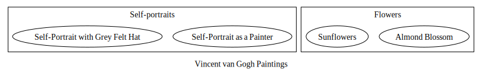

# Препроцессор для Markdown

Утилита, добавляющая некоторые возможности к Markdown

  - [umba-md-pp - Markdown препроцессор](#user-content-umba-md-pp---markdown-препроцессор)
  - [Важные ссылки](#user-content-важные-ссылки)
    - [Тест макроподстановки в именах включаемых файлов](#user-content-тест-макроподстановки-в-именах-включаемых-файлов)
  - [Основные возможности](#user-content-основные-возможности)
  - [Failed to copy temp file 'C:\work\github\umba-tools\umba-md-pp\.\doc\generated_images\$temp$.svg' to target file 'C:\work\github\umba-tools\umba-md-pp\.\doc\generated_images\doc\dot\test001.svg', error: 2](#user-content-failed-to-copy-temp-file-cworkgithubumba-toolsumba-md-ppdocgenerated_imagestempsvg-to-target-file-cworkgithubumba-toolsumba-md-ppdocgenerated_imagesdocdottest001svg-error-2)
  - [Failed to copy temp file 'C:\work\github\umba-tools\umba-md-pp\.\doc\generated_images\$temp$.svg' to target file 'C:\work\github\umba-tools\umba-md-pp\.\doc\generated_images\doc\dot\test004.svg', error: 2](#user-content-failed-to-copy-temp-file-cworkgithubumba-toolsumba-md-ppdocgenerated_imagestempsvg-to-target-file-cworkgithubumba-toolsumba-md-ppdocgenerated_imagesdocdottest004svg-error-2)
  - [Failed to calling 'dot', result code: 1, command line: "C:\Program Files\Graphviz\bin\dot.exe" -Tsvg -Gdpi=96 -o C:\work\github\umba-tools\umba-md-pp\.\doc\generated_images\$temp$.svg C:\work\github\umba-tools\umba-md-pp\.\doc\generated_images\$temp$.dot](#user-content-failed-to-calling-dot-result-code-1-command-line-cprogram-filesgraphvizbindotexe--tsvg--gdpi96--o-cworkgithubumba-toolsumba-md-ppdocgenerated_imagestempsvg-cworkgithubumba-toolsumba-md-ppdocgenerated_imagestempdot)

# umba-md-pp - Markdown препроцессор

**umba-md-pp** - препроцессор для подготовки документации с использованием markdown-разметки
простого текста.

# Важные ссылки

 - [Перечень страниц (индекс документации)](pages.md)
 - [TODO](doc/todo.md)

## Тест макроподстановки в именах включаемых файлов

Этот файл подключен со значением макроса `INSERT_DOC_FILENAME_MACRO_TEST`, равным `by_macro2`.

# Основные возможности

Основные возможности **umba-md-pp**:

  - умеет автоматически нумеровать разделы документа (`--processing-options=numeric-sections`);
  - умеет автоматически формировать раздел "Содержание" и включать его в любом месте документа
    по команде `#!toc`/`#$toc`,
    или в начале документа, если положение TOC не задано в документе (`--processing-options=generate-toc`);
  - умеет вставлять внешние документы из отдельных файлов, как часть текущего документа,
    при этом изменяя уровень заголовков вставляемого документа (`#!insert{doc,raise=+-N} included_doc.md`);
  - умеет вставлять в документ фрагменты кода из внешних файлов, по тэгам и по номерам
    строк, при этом добавляя номера строк исходного файла, и имя файла, откуда было сделано
    включение (`#!insert{line-no} snippets.cpp#CODE_FRAGMENT_NAME`);
  - умеет задавать условные переменные для проверки их при включении файлов или фрагментов кода (`--set-condition-var=ALLOW_EXTERNAL_INC:1`);
  - умеет при включении файлов или фрагментов кода из внешних файлов проверять заданные условия и производить
    включение документов/фрагментов кода по условию (`#!insert{ifdef:ALLOW_EXTERNAL_INC,if:$ALLOW_EXTERNAL_INC!=0,if:$google_inc!=0} google_inc.md`);
  - умеет в условное включение документов и/или фрагментов кода при наличии файла документа/кода: при ошибке
    включения документа можно подавить сообщения об ошибках (`#!insert{no-fail} ...`);
  - умеет однострочные коментарии вида `#//`;
  - умеет многострочные коментарии вида `#/*`/`#*/`;
  - умеет в метаданные **Markdown**;

Пытаемся в графы

# Failed to copy temp file 'C:\work\github\umba-tools\umba-md-pp\.\doc\generated_images\$temp$.svg' to target file 'C:\work\github\umba-tools\umba-md-pp\.\doc\generated_images\doc\dot\test001.svg', error: 2

# Failed to copy temp file 'C:\work\github\umba-tools\umba-md-pp\.\doc\generated_images\$temp$.svg' to target file 'C:\work\github\umba-tools\umba-md-pp\.\doc\generated_images\doc\dot\test004.svg', error: 2

# Failed to calling 'dot', result code: 1, command line: "C:\Program Files\Graphviz\bin\dot.exe" -Tsvg -Gdpi=96 -o C:\work\github\umba-tools\umba-md-pp\.\doc\generated_images\$temp$.svg C:\work\github\umba-tools\umba-md-pp\.\doc\generated_images\$temp$.dot

