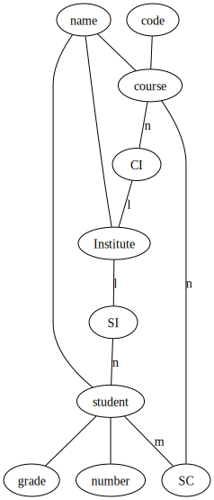
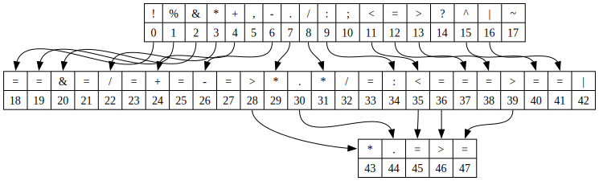
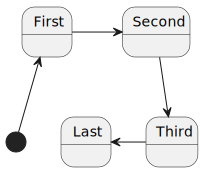

**Информация о документе**

**Описание**: Утилита, добавляющая некоторые возможности к Markdown

**Авторы**:
- Имя <name@at.domain.com>
- Имя2 <name2@domain.com>
- HelloFromDot <ehlo@dot.org>
- HelloFromPuml <ehlo@puml.org>

**URL**: https://github.com/al-martyn1/umba-md-pp/blob/main/README.md

---

# Препроцессор для Markdown

Утилита, добавляющая некоторые возможности к Markdown

- [Важные ссылки](#важные-ссылки)
  - [Usage](#usage)
  - [Options](#options)
  - [Тест макроподстановки в именах включаемых файлов](#тест-макроподстановки-в-именах-включаемых-файлов)
- [comment line](#comment-line)
- [Основные возможности](#основные-возможности)
- [Пакетный режим](#пакетный-режим)
- [Локальная утилита просмотра .md_ и .md файлов](#локальная-утилита-просмотра-md_-и-md-файлов)
- [Поддержка GraphViz](#поддержка-graphviz)
- [Поддержка PlantUML](#поддержка-plantuml)
- [Вставка таблиц CSV](#вставка-таблиц-csv)
- [Вставка сниппетов](#вставка-сниппетов)
- [Стандартный конфиг](#стандартный-конфиг)
- [Любите ли вы документацию так, как люблю её я?](#любите-ли-вы-документацию-так-как-люблю-её-я)
- [GraphViz Samples](#graphviz-samples)
- [PlantUML Samples](#plantuml-samples)
- [Boost MSM](#boost-msm)


---
**Авторы**:
- Имя <name@at.domain.com>
- Имя2 <name2@domain.com>
- HelloFromDot <ehlo@dot.org>
- HelloFromPuml <ehlo@puml.org>

**URL**: https://github.com/al-martyn1/umba-md-pp/blob/main/README.md

---


|Spec|Lang|Description|
|---:|:---:|:---|
|**other**|a|b c d e<br/><br/> \|f\||
|**some**|||
|`none`|`P`/`C`|As `'s'`.|
|`'s'`|`P`/`C`|Prints string|
|`'?'`|`C`|Prints escaped string.<br/><br/> See later "Escaping"|


# Важные ссылки

- [Перечень страниц (индекс документации)](doc/Index.md)
- [TODO](doc.drafts/todo.md)
- [Опции командной строки](doc/umba-md-pp-cli-options.md)
- [Основные исходники](doc/_sources_brief.md)


12.csv

|Text|Author|
|:---|:---|
|He said "Hello"|Alice|


12.csv - csv-title=no

|||
|:---|:---|
|Text|Author|
|He said "Hello"|Alice|


13.csv

|Name|Age|City|
|:---|:---|:---|
|John|30|New York|


excel_test01_comma.csv

|Name|Surname|Age|Address|
|:---|:---|:---|:---|
|John|Smith|25|123 Main St, Apt 5|
|John|Doe|32|432 Broadway<br/><br/>535|
|Dick|Parret|43|826 Castle Rock ave|
|Maria|Magdalina|29|Jerusalem's Lot|
|Charles|Boone||Preacher's Corners|
|Calvin|McCann||Preacher's Corners|


excel_test01_dos.csv

|Name|Surname|Age|Address|
|:---|:---|:---|:---|
|John|Smith|25|123 Main St, Apt 5|
|John|Doe|32|432 Broadway<br/><br/>535|
|Dick|Parret|43|826 Castle Rock ave|
|Maria|Magdalina|29|Jerusalem's Lot|
|Charles|Boone||Preacher's Corners|
|Calvin|McCann||Preacher's Corners|


excel_test01_semicolon.csv

|Name|Surname|Age|Address|
|:---|:---|:---|:---|
|John|Smith|25|123 Main St, Apt 5|
|John|Doe|32|432 Broadway<br/><br/>535|
|Dick|Parret|43|826 Castle Rock ave|
|Maria|Magdalina|29|Jerusalem's Lot|
|Charles|Boone||Preacher's Corners|
|Calvin|McCann||Preacher's Corners|


excel_test01_tabs.csv

|Name|Surname|Age|Address|
|:---|:---|:---|:---|
|John|Smith|25|123 Main St, Apt 5|
|John|Doe|32|432 Broadway<br/><br/>535|
|Dick|Parret|43|826 Castle Rock ave|
|Maria|Magdalina|29|Jerusalem's Lot|
|Charles|Boone||Preacher's Corners|
|Calvin|McCann||Preacher's Corners|


excel_test01_tabs.csv - csv-title=merge title

|Имя|Фамилия|Возраст|Адрес|
|:---|:---|---:|:---|
|John|Smith|25|123 Main St, Apt 5|
|John|Doe|32|432 Broadway<br/><br/>535|
|Dick|Parret|43|826 Castle Rock ave|
|Maria|Magdalina|29|Jerusalem's Lot|
|Charles|Boone||Preacher's Corners|
|Calvin|McCann||Preacher's Corners|


excel_test01_comma_semicolon_multi.csv - multi-title

Первая таблица из мультитаблицы с разделителем запятая:

|Name|Surname|Age|Address|
|:---|:---|:---|:---|
|John|Smith|25|123 Main St, Apt 5|
|John|Doe|32|432 Broadway<br/><br/>535|
|Dick|Parret|43|826 Castle Rock ave|
|Maria|Magdalina|29|Jerusalem's Lot|
|Charles|Boone||Preacher's Corners|
|Calvin|McCann||Preacher's Corners|


Вторая таблица из мультитаблицы с разделителем точка с запятой:

|Name|Surname|Age|Address|
|:---|:---|:---|:---|
|John|Smith|25|123 Main St, Apt 5|
|John|Doe|32|432 Broadway<br/><br/>535|
|Dick|Parret|43|826 Castle Rock ave|
|Maria|Magdalina|29|Jerusalem's Lot|
|Charles|Boone||Preacher's Corners|
|Calvin|McCann||Preacher's Corners|


## Usage

```
umba-md-pp [OPTIONS] input_file [output_file]
```

If output_file not taken, STDOUT used.


## Options


**-q**,
**--quet** - Operate quetly.

**--info=info-type1[,+info-type2,-info-type]** - Make info messages enabled/disabled, '+' (doc/or nothing) - enable message, '-' - disable it. Type is one of: `auto-url`, `config`, `graphviz`, `meta-tags`, `opt-files`, `page-index`, `plantuml`, `snippet-lookup`, `strip-extentions`.

**--warning=warn-type1[,+warn-type2,-warn-type]** - Make warning messages enabled/disabled, '+' (doc/or nothing) - enable message, '-' - disable it. Type is one of: `graphviz`, `img-copy`, `img-copy-exist`, `plantuml`, `same-file`.

**--home** - Open homepage.

**--no-builtin-options** - Don't parse predefined options from main distribution options file.

**--no-custom-builtin-options** - Don't parse predefined options from custom global options file.

**--no-user-builtin-options** - Don't parse predefined options from user local options file.

**-v**,
**--version** - Show version number.

**--version-info** - Show version info - app name, version, host platform, build date and time.

**--builtin-options-info** - Show builtin options files location.

**--where** - Show where the executable file is.

**--color=CLR** - Force set console output coloring.
Allowed values: `file`/`no`/`none`, `ansi`/`term` or `cmd`/`console`/`win`/`win32`/`windows`, initial value: `<AUTO>`.

**--verbose[=MODE]** - Verbose mode on/off.
Flag option, allowed values: `+`/`1`/`Y(es)`/`T(rue)` or /`-`/`0`/`N(o)`/`F(alse)`, default value: `TRUE`.

**-Y[=MODE]**,
**--overwrite[=MODE]** - Allow overwrite existing file.
Flag option, allowed values: `+`/`1`/`Y(es)`/`T(rue)` or /`-`/`0`/`N(o)`/`F(alse)`, default value: `TRUE`.

**-L=LINEFEED**,
**--LF=LINEFEED**,
**--linefeed=LINEFEED** - Output linefeed. LINEFEED is one of: `CR`/`LF`/`CRLF`/`LFCR`/`DETECT`.Default is `CRLF`.

**-I=PATH**,
**--add-examples-path=PATH** - Add paths list for examples searching.

**-E=LANG:EXT[,EXT...]**,
**--add-lang-file-extention=LANG:EXT[,EXT...]**,
**--add-lang-file-extentions=LANG:EXT[,EXT...]** - Add file extention for the lang for lang detection.

**-P=LANG:PREFIX**,
**--add-lang-cut-prefix=LANG:PREFIX** - Add prefix for the cut labels in the lang files.

**--add-lang-separator-prefix=LANG:PREFIX** - Add lang prefix for the separator line.

**--set-lang-block-chars=LANG:{}** - Set lang block open and close characters, like "{}" for C/C++.

**-T=LANG:TAG**,
**--set-lang-listing-tag=LANG:TAG** - Set target markdown tag for the code section.

**-O=OPTS**,
**--set-insert-options=OPTS** - Set default insert options.

**--processing-options=OPTS** - Set processing (output generation) options.

**-C=VAR:VAL**,
**--set-var=VAR:VAL**,
**--set-condition-var=VAR:VAL** - Set variable valie for conditions and substitutions.

**-R=NAME**,
**--target-renderer=NAME** - Set target renderer (`github`/`doxygen`).

**--target-format=NAME** - Set target format (md/html/rtf/pdf).

**--target-name=NAME**,
**--rendering-target-name=NAME** - Set target name.

**-m=TAG:REPLACETO**,
**--meta-tag-replace=TAG:REPLACETO** - Add meta tag name replacement.

**-M=TAG:SERIALIZETO**,
**--meta-tag-serialize=TAG:SERIALIZETO**,
**--meta-tag-serialize-as=TAG:SERIALIZETO** - Add meta tag name for serialization.

**--meta-tag-set-type=TYPE:TAG[,TAG...]**,
**--set-meta-tag-type=TYPE:TAG[,TAG...]** - Set meta tag type (doc/`TextFirst`/`TextReplace`/`TextMerge`/`List`/`CommaList`/`Set`/`CommaSet`/`UniqueList`/`UniqueCommaList`/`RootOnly`).

**--serialize-meta-tags=TAG[,TAG...]**,
**--meta-tag-serialize-list=TAG[,TAG...]** - Set/append meta tag serialize list to add to meta section. Use `+` sign at first position to append tags to list.

**--document-meta-tags=TAG[,TAG...]** - Set/append list of meta tags to add to document body/text. Use `+` sign at first position to append tags to list.

**--numeric-sections-max-level=LEVEL** - Set max level for sections numeration.
Allowed values: `0`/`inf`/`infinite`, `1`, `2`, `3`, `4`, `5`, `6`, `7`, `8`, `9`, `10`, `11`, `12`, `13`, `14`, `15` or `16`, initial value: `infinite`.

**--toc-max-level=LEVEL** - Set max section level for table of contents (TOC).
Allowed values: `0`/`inf`/`infinite`, `1`, `2`, `3`, `4`, `5`, `6`, `7`, `8`, `9`, `10`, `11`, `12`, `13`, `14`, `15` or `16`, initial value: `infinite`.

**--restrict-path-raise=RAISE** - Raise insert restriction path up to 4 levels max.
Min value: `0`, max value: `4`, initial value: ` `.

**--document-language=LANG** - Set default document language, which used if no language tag in document meta info.

**--force-document-language=LANG** - Force set document language, override document meta info.

**--batch-output-path=PATH**,
**--batch-output-root=PATH** - Set output root path for batch mode.

**-X=MASK,...**,
**--batch-exclude-files=MASK,...** - Exclude files from parsing in the batch mode. The `MASK` parameter is a simple file mask, where `*` means any number of any chars, and `?` means exact one of any char. In addition, symbol `^` in front and/or back of the mask means that the mask will be bound to beginning/ending of the tested file name.
Also, regular expresion syntax allowed in form `{*?regex?*}YOURREGEX`. The regular expresions supports
See also: C++ Modified ECMA Script regular expression grammar - https://en.cppreference.com/w/cpp/regex/ecmascript.

**--batch-exclude-dir=DIRNAME,...**,
**--batch-exclude-dirs=DIRNAME,...** - Exclude dirs from scaning in the batch mode. The 'DIRNAME' parameter is a simple directory name, not a mask.

**--batch-scan=DIRNAME,...** - Perform batch job on taken directories.

**--batch-rscan=DIRNAME,...**,
**--batch-scan-recurse=DIRNAME,...** - Perform batch job on taken directories with recursion scan.

**--batch-page-index-file=FILE**,
**--batch-pages-index-file=FILE** - Set index of processed pages file name.

**--batch-generate-page-index[=MODE]**,
**--batch-generate-page-index-file[=MODE]** - Generate index of processed pages.
Flag option, allowed values: `+`/`1`/`Y(es)`/`T(rue)` or /`-`/`0`/`N(o)`/`F(alse)`, default value: `TRUE`.

**--batch-git-add-file=FILE**,
**--batch-generate-git-add-file=FILE** - Generate bat/shell script with git add commands for all generated files.

**--batch-split-page-index-file[=MODE]**,
**--batch-split-pages-index-file[=MODE]** - Generate index of processed pages.
Flag option, allowed values: `+`/`1`/`Y(es)`/`T(rue)` or /`-`/`0`/`N(o)`/`F(alse)`, default value: `TRUE`.

**--copy-images[=MODE]**,
**--copy-image-files[=MODE]** - Copy image files to output folder, if it taken. No effect if output path not taken (doc/see --batch-output-root) nor single file output path folder not equal to source path.
Flag option, allowed values: `+`/`1`/`Y(es)`/`T(rue)` or /`-`/`0`/`N(o)`/`F(alse)`, default value: `TRUE`.

**--flatten-image-links[=MODE]** - Flatten image links: 'some/path/to/image.png' becomes to 'some_path_to_image.png'. No effect if output path not taken (doc/see --batch-output-root) nor single file output path folder not equal to source path.
Flag option, allowed values: `+`/`1`/`Y(es)`/`T(rue)` or /`-`/`0`/`N(o)`/`F(alse)`, default value: `TRUE`.

**--viewer-copy-to-source[=MODE]**,
**--viewer-copy-render-to-source-location[=MODE]** - Copy generated (doc/rendered) file to source file location.
Flag option, allowed values: `+`/`1`/`Y(es)`/`T(rue)` or /`-`/`0`/`N(o)`/`F(alse)`, default value: `TRUE`.

**--viewer-copy-use-title[=MODE]**,
**--viewer-render-copy-use-doc-title[=MODE]** - Copy generated (doc/rendered) file to source file location with file name obtained from the document title.
Flag option, allowed values: `+`/`1`/`Y(es)`/`T(rue)` or /`-`/`0`/`N(o)`/`F(alse)`, default value: `TRUE`.

**--strip-ext[=MODE]**,
**--strip-extention[=MODE]**,
**--strip-extentions[=MODE]** - Strip supported extentions in the local links.
Flag option, allowed values: `+`/`1`/`Y(es)`/`T(rue)` or /`-`/`0`/`N(o)`/`F(alse)`, default value: `TRUE`.

**--gv-dpi=DPI**,
**--gviz-dpi=DPI**,
**--graphviz-dpi=DPI** - Set DPI for Graphviz tools output.

**--gv-output-format=FORMAT**,
**--gviz-output-format=FORMAT**,
**--graphviz-output-format=FORMAT** - Set Graphviz tools output format (SVG/PNG).

**--gv-output-path=PATH**,
**--gv-output-root=PATH**,
**--gviz-output-path=PATH**,
**--gviz-output-root=PATH**,
**--graphviz-output-path=PATH**,
**--graphviz-output-root=PATH** - Set Graphviz tools output root path.

**--gv-show-labels[=MODE]**,
**--gviz-show-labels[=MODE]**,
**--graphviz-show-labels[=MODE]** - Show labels on Graphviz graphs.
Flag option, allowed values: `+`/`1`/`Y(es)`/`T(rue)` or /`-`/`0`/`N(o)`/`F(alse)`, default value: `TRUE`.

**--gv-keep-temp-dot-files[=MODE]**,
**--gviz-keep-temp-dot-files[=MODE]**,
**--graphviz-keep-temp-dot-files[=MODE]** - Keep temporary dot files.
Flag option, allowed values: `+`/`1`/`Y(es)`/`T(rue)` or /`-`/`0`/`N(o)`/`F(alse)`, default value: `TRUE`.

**--add-mdpp-extention=EXT[,EXT...]**,
**--add-mdpp-extentions=EXT[,EXT...]** - Add file extentions of the MD-PP files.

**--dont-lookup-for-doxygen[=MODE]** - Do not lookup for Doxygen (doc/in registry).
Flag option, allowed values: `+`/`1`/`Y(es)`/`T(rue)` or /`-`/`0`/`N(o)`/`F(alse)`, default value: `TRUE`.

**--dont-lookup-for-graphviz[=MODE]** - Do not lookup for Graphviz (doc/in registry).
Flag option, allowed values: `+`/`1`/`Y(es)`/`T(rue)` or /`-`/`0`/`N(o)`/`F(alse)`, default value: `TRUE`.

**--java=JAVA_EXE** - Set Java executable full path name.

**--java-home=JAVA_HOME** - Set Java home. Java executable must exist as $(JAVA_HOME)/bin/java.

**--plantuml=PLANTUML_JAR**,
**--plant-uml=PLANTUML_JAR** - Set Plant UML jar full path name.

**--puml-output-format=FORMAT**,
**--plantuml-output-format=FORMAT**,
**--plant-uml-output-format=FORMAT** - Set PlantUML output format (SVG/PNG).

**--puml-output-path=PATH**,
**--puml-output-root=PATH**,
**--plantuml-output-path=PATH**,
**--plantuml-output-root=PATH**,
**--plant-uml-output-path=PATH**,
**--plant-uml-output-root=PATH** - Set PlantUML output root path.

**--puml-show-labels[=MODE]**,
**--plantuml-show-labels[=MODE]**,
**--plant-uml-show-labels[=MODE]** - Show labels on PlantUML raphs.
Flag option, allowed values: `+`/`1`/`Y(es)`/`T(rue)` or /`-`/`0`/`N(o)`/`F(alse)`, default value: `TRUE`.

**--generated-output-path=PATH**,
**--generated-output-root=PATH** - Set output root path for generated files (same as `--graphviz-output-path=PATH --plant-uml-output-path=PATH`).

**--clear-generation-cache[=MODE]** - Clear cached information of the generated files - force regenerate all images on next call. No other actions will be performed if this option was taken.
Flag option, allowed values: `+`/`1`/`Y(es)`/`T(rue)` or /`-`/`0`/`N(o)`/`F(alse)`, default value: `TRUE`.

**--gcc** - GCC messages format instead of MSVC format.

**--autocomplete-install** - Install autocompletion to bash/clink(cmd).

**--autocomplete-uninstall** - Remove autocompletion from bash/clink(cmd).


## Тест макроподстановки в именах включаемых файлов

Этот файл подключен со значением макроса `INSERT_DOC_FILENAME_MACRO_TEST`, равным `by_macro2`.


> \#--serialize-meta-tags=+title,author,description,date,language
> --serialize-meta-tags=-
> \#--processing-options=meta-data
> \#--processing-options=no-meta-data
> --processing-options=generate-toc,force-insert-meta,document-meta-title,meta-data-subst
> \# --processing-options=meta-data
> --processing-options=no-meta-data
> --document-meta-tags=brief,author,url
> --serialize-meta-tags=title,author,generator,brief,url
> ; --set-var=UrlBase:https://github.com/al-martyn1
> --processing-options=auto-url
> --set-var=__DocumentBaseUrl:https://github.com/al-martyn1/umba-md-pp/blob/main/
> --verbose
> --info=+all
> \# --info=-plantuml,-opt-files,-snippet-lookup
> --generated-output-path=.\doc\img.generated
> \# --graphviz-output-path=.\doc\.generated_images
> \# --plant-uml-output-path=.\doc\.generated_images
> --document-language=russian
> \#--processing-options=transliterate-generated-filenames
> \# --copy-images
> \# --flatten-image-links
> --viewer-copy-render-to-source-location
> \#--viewer-render-copy-use-doc-title
> \#--set-var=INSERT_DOC_FILENAME_MACRO_TEST:by_macro2
> --set-var=^insert_doc_filename_macro_test:by_macro2
> 
> --add-examples-path=.
> --add-examples-path=.\doc
> --add-examples-path=.\doc.drafts
> --add-examples-path=.\conf
> --add-examples-path=.\tests\snippets
> --add-examples-path=.\_src
> --add-examples-path=.\src

<!-- -->

code

```
```
# comment line
   Sample generic listing
   template<typename T> std::string f(T<A> &ta)
   {
       return std::string("abra-shvabra'");
   }
```
```

quote

> \```
>  \# comment line
>    Sample generic listing
>    template<typename T> std::string f(T<A> &ta)
>    {
>        return std::string("abra-shvabra'");
>    }
> \```

<!-- -->

pre

<pre>
```
 # comment line
   Sample generic listing
   template&lt;typename T&gt; std::string f(T&lt;A&gt; &amp;ta)
   {
       return std::string(&quot;abra-shvabra&apos;&quot;);
   }
```
</pre>

<!-- -->

quote,pre

> <pre>
> ```
>  # comment line
>    Sample generic listing
>    template&lt;typename T&gt; std::string f(T&lt;A&gt; &amp;ta)
>    {
>        return std::string(&quot;abra-shvabra&apos;&quot;);
>    }
> ```
> </pre>

<!-- -->

doc

```
 # comment line
   Sample generic listing
   template<typename T> std::string f(T<A> &ta)
   {
       return std::string("abra-shvabra'");
   }
```


# Основные возможности

Основная идея была в том, чтобы писать и хранить документацию по софтовым проектам непосредственно в проекте,
не используя никакие дополнительные конфлюэнцы и тп.

Doxygen - имеет право на жизнь, но, в основном, как средство создания полновесной справочной документации.
Такая документация не всегда нужна, да и сложно заставить разработчиков документировать каждую функцию.
При этом, даже если каждая функция задокументированна, общее предствление, как всем этим добром пользоваться,
справочная документация не даёт.

Хорошим вариантом видится написание статей по тем или иным аспектам использования кода/библиотек, которые бы лежали
непосредственно рядом с исходным кодом.

Язык разметки markdown выглядит для этого довольно неплохо, и он из коробки поддерживается GitHub'ом и GitLab'ом - 
можно зайти в репозиторий через браузер и изучать документацию прямо там.

У markdown есть недостаток - всё содержимое должно быть включено в MD-документ. Это неудобно, когда
мы описываем вещи и явления, не зависящие от нас - нам приходится следить, чтобы содержимое MD-файлов 
соответствовало реальному положению дел.

Это довольно трудозатратно. Но что если попробовать научить markdown брать текст документа из внешних документов 
и исходных тестов программ? Тогда нам нужен препроцессор.

Вторая проблема при ведении документации в формате markdown или каком-то аналогичном - 
это то, что нет никаких средств для локального просмотра. Я попытался решить и эту проблему, сделав локальный рендерер
(пока он работает на базе Doxygen). Локальный рендерер при вызове создаёт временную папку в домашнем каталоге пользователя, 
подготавливает файл для генерации конечного документа, вызывает Doxygen для генерации RTF, и открывает полученный RTF
в ассоциированной с ним программе (обычно это MS Word). Локальный рендерер умеет интегрироваться в систему, и просмотр 
`.MD` файлов запускается по клику из проводника (бонусов идёт то, что `.MD` отображаются с соответствующей иконкой в проводнике).
Локальный рендерер реализован пока только под ОС Windows.

Основные возможности **umba-md-pp**:

- умеет автоматически нумеровать разделы документа (`--processing-options=numeric-sections`);
- умеет автоматически формировать раздел "Содержание" и включать его в любом месте документа
  по команде `#!toc`/`#$toc`,
  или в начале документа, если положение TOC не задано в документе (`--processing-options=generate-toc`);
- умеет вставлять внешние документы из отдельных файлов, как часть текущего документа,
  при этом изменяя уровень заголовков вставляемого документа (`#!insert{doc,raise=+-N} included_doc.md`);
- умеет вставлять в документ фрагменты кода из внешних файлов, по тэгам и по номерам
  строк, при этом добавляя номера строк исходного файла, и имя файла, откуда было сделано
  включение (`#!insert{line-no} snippets.cpp#CODE_FRAGMENT_NAME`);
- умеет задавать условные переменные для проверки их при включении файлов или фрагментов кода (`--set-condition-var=ALLOW_EXTERNAL_INC:1`);
- умеет при включении файлов или фрагментов кода из внешних файлов проверять заданные условия и производить
  включение документов/фрагментов кода по условию (`#!insert{ifdef:ALLOW_EXTERNAL_INC,if:$ALLOW_EXTERNAL_INC!=0,if:$google_inc!=0} google_inc.md`);
- умеет в условное включение документов и/или фрагментов кода при наличии файла документа/кода: при ошибке
  включения документа можно подавить сообщения об ошибках (`#!insert{no-fail} ...`);
- умеет однострочные коментарии вида `#//`;
- умеет многострочные коментарии вида `#/*`/`#*/`;
- умеет в метаданные **Markdown**;


# Пакетный режим

В пакетном режиме утилита просматривает все файлы `.md_` (на самом деле входных расширений больше),
и генерирует рядом процессированные `.md` файлы (расширение зависит от входного).

Процессинг может производится не "по месту", а в отдельную папку - так можно генерировать содержимое
GitHub/GitLab wiki, например.


# Локальная утилита просмотра .md_ и .md файлов

Локальная утилита просмотра умеет регистрироваться в системе под текущим пользователем для поддерживаемых расширений,
и по клику в проводнике открывать RTF, сгенерированный из markdown'а.

Для рендеринга в текущий момент используется Doxygen, в далёких планах - сделать свой рендерер.


# Поддержка GraphViz

Утилита позволяет в расширенном markdown'е вставлять графы на языке GraphViz как непосредственно
в теле докумена, так и из внешнего файла. Требуется установленный GraphViz (обычно ставится вместе с Doxygen).
Используются тэги `<graph>`/`</graph>`.


# Поддержка PlantUML

В ближайшее время планируется поддержка PlantUML для рендеринга UML из языка PlantUML, по аналогии с GraphViz.


# Вставка таблиц CSV

Предполагается генерация таблиц из внедрённого или внешнего CSV.


# Вставка сниппетов

На фрагменты кода можно ссылаться через имя файла и якорь: `src/somefile.cpp#400-410`.

Якоря имеют диапазон: стартовый якорь, и конечный якорь.

Стартовый якорь:

- тэг. Для каждого языка задается префикс тэга, например, для C++ это `//#!`. После префикса идёт имя тэга без пробелов.
  Окончание фрагмента ищется как пустой префикс ил префикс с таким же тэгом. Учитывается вложенность. Вложенные тэги при вставке
  могут удаляться или заменятся пустой строкой (чтобы не ломать количество строк).
- номер строки.
- сигнатура кода. Пробелы не участвуют в сравнении. В якоре сигнатуру можно задать в одну строку, в исходниках, где она ищется, 
  сигнатура может быть размазана по нескольким строкам. В случае сигнатур можно задавать последовательность - 
  "вставить фрагмент с сигнатурой, которая появляется после сигнатуры1 и сигнатуры2"

Конечный якорь. Допустимы стартовые якоря, а также:
- якорь `{}` - означает вставку блока, ограниченного блоковыми скобками, 
  с учетом вложенности (но строковые литералы не разбираются, на них может происходить сбой, если они содержат блоковые символы).
  Блоковые символы задаются для каждого языка отдельно.
- якорь `(N)`, где N - число пустых строк, по обнаружению которых детектится конец фрагмента кода.
- якорь `(-)` - линия-разделитель, задаётся для каждого языка отдельно в произвольном количестве вариантов, для C++ это, например,
  `//---` или `/***`. Задаются только префиксы, т.е. `//------------` - это тоже линия разделитель

Извлекаем фрагмент кода по тэгу фрагмента:
```
#!insert{nolineno,noKeepCutTags,filename,path,filename-line-no} umba-md-pp/for_tag_test.cpp#TEST_TAG
```

**umba-md-pp/for_tag_test.cpp:3**
```cls-prototype-format:cc-cls-ptt-format
void test()
{
}
```

```
#!insert{nolineno,noKeepCutTags} umba-md-pp/enums.h#SnippetOptions
```

```cls-prototype-format:cc-cls-ptt-format
enum class SnippetOptions : std::uint32_t
{
    invalid            = (std::uint32_t)(-1) /*!<  */,
    unknown            = (std::uint32_t)(-1) /*!<  */,
    noLineNo           = 0x1010 /*!< Do not add line numbers to generated listing */,
    lineNo             = 0x1011 /*!< Add line numbers to generated listing */,
    noTrim             = 0x1020 /*!< Do not trim left inserted code */,
    noTrimLeft         = 0x1020 /*!< Do not trim left inserted code */,
    trim               = 0x1021 /*!< Trim left inserted code */,
    trimLeft           = 0x1021 /*!< Trim left inserted code */,
    noTag              = 0x1030 /*!< Do not add language tag */,
    noLangTag          = 0x1030 /*!< Do not add language tag */,
    tag                = 0x1031 /*!< Add language tag */,
    langTag            = 0x1031 /*!< Add language tag */,
    noFilename         = 0x1040 /*!< Do not add filename to listing */,
    filename           = 0x1041 /*!< Add filename to listing */,
    noPath             = 0x1050 /*!< Do not add full path to filename (filename option) */,
    path               = 0x1051 /*!< Add full path to filename (filename option) */,
    noFail             = 0x1060 /*!< If insertion file not found, don't add insert command text to result - used for C++ __has_include emulation. If there is some other failures occurs (such invalif options), wrong line will be always inserted */,
    fail               = 0x1061 /*!< If insertion file not found, add insert command text to result. If there is some other failures occurs (such invalif options), wrong line will be always inserted. Default is set in basic configs */,
    noKeepCutTags      = 0x1070 /*!< Don't keep nested cut tags/markers */,
    keepCutTags        = 0x1071 /*!< Keep nested cut tags/markers */,
    noFilenameLineNo   = 0x1080 /*!< Do not add line number to filename before liting */,
    filenameLineNo     = 0x1081 /*!< Add line number to filename before listing */,
    noSnippetOptions   = 0x1090 /*!< Do not add actual snippet options line before listing */,
    snippetOptions     = 0x1091 /*!< Add actual snippet options line before listing */,
    noTrimArround      = 0x10A0 /*!< Do not trim empty lines before and after listing */,
    trimArround        = 0x10A1 /*!< Trim empty lines before and after listing */,
    noDoc              = 0x10B0 /*!< -doc */,
    doc                = 0x10B1 /*!< Insert as external document, or as snippet otherwise */,
    noQuote            = 0x10C0 /*!< -quote */,
    noQuot             = 0x10C0 /*!< -quote */,
    quote              = 0x10C1 /*!< Insert as blockquote */,
    quot               = 0x10C1 /*!< Insert as blockquote */,
    noPre              = 0x10D0 /*!< -pre */,
    pre                = 0x10D1 /*!< pre itself or for inserted quote lines */,
    noProtodoc         = 0x10E0 /*!< -protodoc */,
    noPdoc             = 0x10E0 /*!< -protodoc */,
    protodoc           = 0x10E1 /*!< Generate documentation for prototype */,
    pdoc               = 0x10E1 /*!< Generate documentation for prototype */,
    noFormat           = 0x10F0 /*!< -format */,
    noFmt              = 0x10F0 /*!< -format */,
    format             = 0x10F1 /*!< format option. For example, for `prototype` option `format` flag tells to format function prototype, else prototype inserted as is */,
    fmt                = 0x10F1 /*!< format option. For example, for `prototype` option `format` flag tells to format function prototype, else prototype inserted as is */,
    noClass            = 0x1100 /*!< -class */,
    noCls              = 0x1100 /*!< -class */,
    class_             = 0x1101 /*!< class option for prototype extraction. */,
    cls                = 0x1101 /*!< class option for prototype extraction. */,
    subsection         = 0x1811 /*!< Insert document as subsection - adjust section levels to current insertion pos */,
    subsec             = 0x1811 /*!< Insert document as subsection - adjust section levels to current insertion pos */,
    prototype          = 0x1821 /*!< Extract prototype from code snippet */,
    raise              = 0x2011 /*!< Raise section levels in included document up to RISE level */

}; // enum
```


Извлекаем фрагмент кода по сигнатуре (прототип, директива prototype):
```
#!prototype umba-md-pp/extern_tools.h#`inline std::string findDoxygenBinPathImpl`
```

```cls-prototype-format:cc-cls-ptt-format
inline std::string findDoxygenBinPathImpl(bool dontTouchSystem);
```


Извлекаем фрагмент кода по сигнатуре (прототип, директива prototype, с форматированием):
```
#!prototype{fmt} umba-md-pp/extern_tools.h#`inline std::string findDoxygenBinPathImpl`
```

```cls-prototype-format:cc-cls-ptt-format
inline std::string findDoxygenBinPathImpl(bool dontTouchSystem);
```


Извлекаем фрагмент кода по сигнатуре:
```
#!insert{nolineno,noKeepCutTags} umba-md-pp/extern_tools.h#`inline std::string findDoxygenBinPathImpl`-{}
```

```cls-prototype-format:cc-cls-ptt-format
inline std::string findDoxygenBinPathImpl(bool dontTouchSystem)
{
    if (dontTouchSystem)
        return std::string();

#if defined(WIN32) && defined(_WIN32)

    std::wstring p;
    if (!umba::win32_utils::regQueryAppInstallLocationBin(std::wstring(L"doxygen_is1"), p))
        return std::string();

    return umba::toUtf8(p);

#else

    return std::string();

#endif
}
```


# Стандартный конфиг

```
# Формат файла опций/ответов (response file)
# В одной строке - только одна опция
# Коментарии начинаются с символа '#' или символа ';'
# Коментарии допустимы только в начале строки

# Управляем предупреждениями и сообщениями
--warning=+all
--info=-all

# Устанавливаем русский как язык документов по умолчанию, если язык не задан мета-тэгами,
# не переопределён дефолтный язык где-то потом или не задан принудительно через опцию
# --force-document-language
# Задание языка необходимо для доксигена, если по дефолту задать не русский, или не задавать язык,
# доксиген кракозяблы генерит
# Если в документе задан метатег `Language`, то он переопределяет то, что задано из командной строки
# Если необходимо принудительно из командной строки задать язык документа,
# вне зависимости от содержимого метатегов документа, то следует использовать опцию командой строки
# --force-document-language
--document-language=russian

# Поиск внешних программ
# При поиске используемых внешних программ используются сведения об этих программах,
# которые оставляют в реестре установщики этих программ.
# Антивирусы могут возбуждаться на запросы к реестру к некоторым разделам.
# Данные опции запрещают это, но в таком случае данные программы должны быть прописаны в системной
# переменной PATH
--dont-lookup-for-doxygen
--dont-lookup-for-graphviz

# Базовые опции
--processing-options=generate-toc,title,meta-data-subst
--set-insert-options=fail,path,filename-line-no,trim-arround,format
--batch-page-index-file=doc/Index.md

# Базовые опции для Graphviz
--graphviz-output-format=svg
--graphviz-dpi=120
--graphviz-show-labels=true

# Расширения, обрабатываемые (и сканируемые) MDPP
--add-mdpp-extentions=_md,_md_,md_
--add-mdpp-extentions=_mkd,_mkd_,mkd_
--add-mdpp-extentions=_mdwn,_mdwn_,mdwn_
--add-mdpp-extentions=_mdown,_mdown_,mdown_
--add-mdpp-extentions=_mdtxt,_mdtxt_,mdtxt_
--add-mdpp-extentions=_mdtext,_mdtext_,mdtext_
--add-mdpp-extentions=_markdown,_markdown_,markdown_
#--add-mdpp-extentions=_text,_text_,text_

# Исключаем из сканирования в пакетном режиме подкаталоги со следующими именами.
# Будем называть это "голубятня", "чердак", "loft"
# В голубятне лежат не обрабатываемые в пакетном режиме файлы, предназначенные для подключения
# в файлы документов. Например, мы хотим создать книгу, и публиковать её как отдельные документы,
# так и как книга в сборе. Тогда мы создаём в голубятне главы книги, а в обрабатываемом каталоге
# аналогичные файлы, единственное действие в которых - подключение соответствующих файлов из голубятни.
# Также в обрабатываемом каталоге мы создаём файл TheBook.md_, в который подключаем все главы
# из голубятни, для сборки всех глав в единый документ.
# Также библиотеки/модули могут содержать свою голубятню, в которой хранятся различные документы,
# включаемые как в документацию по данной библиотеке/модулю, но также и предназначенне для включения
# в конечную документацию по продукту, который создаёт пользователь библиотеки/модуля.
--batch-exclude-dirs=_md,_md_,md_
--batch-exclude-dirs=_mkd,_mkd_,mkd_
--batch-exclude-dirs=_mdwn,_mdwn_,mdwn_
--batch-exclude-dirs=_mdown,_mdown_,mdown_
--batch-exclude-dirs=_mdtxt,_mdtxt_,mdtxt_
--batch-exclude-dirs=_mdtext,_mdtext_,mdtext_
--batch-exclude-dirs=_markdown,_markdown_,markdown_
--batch-exclude-dirs=doc.dox,doc.doxy,doc.doxygen,.dox,.doxy,.doxygen,dox,doxy,doxygen
#--batch-exclude-dirs=_text,_text_,text_

--batch-exclude-dir=.out,.build,.git,.bat,.cmake,.msvc,.vscode,.vs,.config


# При генерации вьювером название файла задается на основании заголовка (из тэгов или первого заголовка,
# или из первых строк) документа
# Но мы придерживаемся идеи не использовать русские имена без крайней необходимости
--processing-options=transliterate-generated-filenames
# --processing-options=no-transliterate-generated-filenames

# Ошибки и опечатки в именах тэгов, а также поддержа русскоязычных тэгов
# Тэги в секции метаданных могут указываться на английском и русском языке, а также во множественном числе,
# например:
# Author, Authors, Автор, Авторы
# Имя тэга транслитерируется, потом приводится к нижнему регистру, после этого начинают работу правила
# 'meta-tag-replace' для приведения имён тэгов к каноническому виду.
--meta-tag-replace=avtor:author
--meta-tag-replace=avtory:author
--meta-tag-replace=authors:author
--meta-tag-replace=tegi:tags
--meta-tag-replace=teg:tags
--meta-tag-replace=data:date
--meta-tag-replace=zagolovok:title
--meta-tag-replace=nazvanie:title
--meta-tag-replace=caption:title
--meta-tag-replace=kategorii:category
--meta-tag-replace=kategoriya:category
--meta-tag-replace=categories:category
--meta-tag-replace=opisanie:description
--meta-tag-replace=otmazka:disclaimer
--meta-tag-replace=otmazki:disclaimer
--meta-tag-replace=disclaimers:disclaimer
--meta-tag-replace=versiya:version
--meta-tag-replace=yazyk:language
--meta-tag-replace=yazyk dokumenta:language
--meta-tag-replace=otkaz ot otvetstvennosti:disclaimer
--meta-tag-replace=generators:generator
--meta-tag-replace=brief:description
--meta-tag-replace=briefs:description

# Сериализация метатегов
# Метатеги исходного документа могут сохраняться в результирующий документ в секцию метатэгов
# Тут задаются правила сериализации канонических имён метатегов
--meta-tag-serialize=title:Title
--meta-tag-serialize=disclaimer:Disclaimer
--meta-tag-serialize=description:Description
--meta-tag-serialize=author:Author
--meta-tag-serialize=category:Category
--meta-tag-serialize=date:Date
--meta-tag-serialize=tags:Tags
--meta-tag-serialize=version:Version
--meta-tag-serialize=language:Language
--meta-tag-serialize=url:URL
--meta-tag-serialize=generator:Generator
--meta-tag-serialize=brief:Brief

# Типы метатегов
# Метатеги в результирующий документ собираются из всех включенных документов,
# а также из внешних диаграмм graphviz и PlantUML
# Метатеги записываются в формате YAML, но есть исключения. Так, списки, например, список авторов
# в каноническом виде должен быть записан так:
# ```
# Author:
#   - Name1 <address1@domain.net>
#   - Name2 <address2@domain.com>
# ```
#
# Но для упрощения список авторов может быть записан и через запятую:
# ```
# Author: Name1 <address1@domain.net>, Name2 <address2@domain.com>
# ```
# При этом автор(ы) основного документа будут идти первыми, а авторы использованных поддокументов
# идут в порядке подключения поддокументов и их порядка там (не зависит от способа оформления метатега).
# Для этого мы устанавливаем тип тэга как comma-unique-list - список, однострочное значение разделяется
# запятой, без повторяющихся значений.
#
# Возможные значения:
#
# root-only - текст, используется только значение из корневого элемента.
#
# text-first - текст, используется только первое значение.
#
# text-replace, text-last - текст, используется только последнее значение.
#
# text, text-merge - текст, используется всё найденное, вставляется группой параграфов.
#
# list - список значений, доступная форма записи - только в виде списка YAML.
#
# unique-list - список значений, аналогично list.
#               В отличие от list, повторяющиеся значения удаляются.
#
# comma-list - список значений, в виде списка YAML или одной строкой, со значениями, разделяемыми запятой.
#              Порядок - по мере обнаружения тэгов.
#
# comma-unique-list, unique-comma-list - список значений, в виде списка YAML или одной строкой, со значениями,
#              разделяемыми запятой. В отличие от comma-list, повторяющиеся значения удаляются.
#
# set - набор уникальных значений, отсортированных лексикографически.
#             Доступная форма записи - только в виде списка YAML.
#             При сортировке не учитываются национальные особенности.
#
# comma-set - аналогично set, но значения могут быть заданы одной строкой, через запятую.
#
# При генерации результирующего документа метатеги форматируются в строки в формате YAML
#
# !!! Не стоит менять базовые настройки, рекомендуется только дополнять их для своих метатегов
#
--meta-tag-set-type=comma-set:category,tags
--meta-tag-set-type=comma-unique-list:author
--meta-tag-set-type=text-first:title,date
--meta-tag-set-type=root-only:url
--meta-tag-set-type=text-merge:disclaimer,description,generator
#,brief

# Настройки для листингов различных языков программирования

# C++
--add-code-file-extentions=C++:.cpp,.cxx,.c++,.cc,.h,.hpp,.h++,.ixx,.i++,.i
--add-code-cut-prefix=C++://#!
--add-code-cut-prefix=C++://#$
--add-code-cut-prefix=C++:/*#!
--add-code-cut-prefix=C++:/*#$
--add-code-separator-prefix=C++://---
--add-code-separator-prefix=C++:/***
--set-code-block-chars=C++:{}
--set-code-statement-separator=C++:;
--set-code-listing-tag=C++:cpp
--set-code-processing-handler=C++:fn-prototype-extract:cc-fn-ptt-extract
--set-code-processing-handler=C++:cls-prototype-extract:cc-cls-ptt-extract
--set-code-processing-handler=C++:fn-prototype-format:cc-fn-ptt-format
--set-code-processing-handler=C++:cls-prototype-format:cc-cls-ptt-format

# C
--add-code-file-extentions=C:.c
--add-code-cut-prefix=C://#!
--add-code-cut-prefix=C://#$
--add-code-cut-prefix=C:/*#!
--add-code-cut-prefix=C:/*#$
--add-code-separator-prefix=C://---
--add-code-separator-prefix=C:/***
--set-code-block-chars=C:{}
--set-code-statement-separator=C++:;
--set-code-listing-tag=C:cpp

# Squrrel
--add-code-file-extentions=Squrrel:.nut,.nuts
--add-code-cut-prefix=Squrrel://#!
--add-code-cut-prefix=Squrrel://#$
--add-code-separator-prefix=Squrrel://---
--set-code-block-chars=Squrrel:{}
--set-code-listing-tag=Squrrel:lua

# CMake
--add-code-file-extentions=CMake:CMakeLists.txt,.cmake
--add-code-cut-prefix=CMake:#//!
--add-code-cut-prefix=CMake:#//$
--add-code-separator-prefix=CMake:###
--add-code-separator-prefix=CMake:#---
# No blocks support in CMake
# --set-code-block-chars=
--set-code-listing-tag=CMake:cmake

# Txt - plain text as code
--add-code-file-extentions=Txt:.txt,.log
--add-code-cut-prefix=Txt://#!
--add-code-cut-prefix=Txt://#$
--add-code-separator-prefix=Txt://---
--add-code-separator-prefix=Txt:---
# No blocks support in Txt
# --set-code-block-chars=Txt:
# No lang tag for Txt
# --set-code-listing-tag=Txt:txt
```


# Любите ли вы документацию так, как люблю её я?

Думаю ещё сделать всяких штук типа эпиграфов, и тп.


# GraphViz Samples








# PlantUML Samples





# Boost MSM

[Boost MSM documentation](https://www.boost.org/doc/libs/1_85_0/libs/msm/doc/HTML/ch03s04.html)


---
**Название**: Препроцессор для Markdown

**Авторы**:
- Имя <name@at.domain.com>
- Имя2 <name2@domain.com>
- HelloFromDot <ehlo@dot.org>
- HelloFromPuml <ehlo@puml.org>

**URL**: https://github.com/al-martyn1/umba-md-pp/blob/main/README.md

**Дата**: April 25, 2024

---


